Heart Disease: EDA and Random forest with R
================
Compiled: February 07, 2021

## Introduction

It is my first kernel on the community so any feedback would be much
appreciated.  
If my work is useful to you, please upvote the code.  
Thanks\!

## Load libraries

  - tidyverse: For data cleaning, sorting, and visualization  
  - DataExplorer: For Exploratory Data Analysis  
  - gridExtra: To plot several plots in one figure  
  - ggpubr: To prepare publication-ready plots  
  - GGally: For correlations  
  - caTools: For classification model
  - rpart: For classification model  
  - rattle: Plot nicer descision trees  
  - randomForest: For Random Forest model

<!-- end list -->

``` r
library(tidyverse)  # For data cleaning, sorting, and visualization
library(DataExplorer) # For Exploratory Data Analysis
library(gridExtra) # To plot several plots in one figure
library(ggpubr) # To prepare publication-ready plots
library(GGally) # For correlations
library(caTools) # For classification model
library(rpart) # For classification model
library(rattle) # Plot nicer descision trees
library(randomForest) # For Random Forest model
```

## I Data

heart-disease-uci Kaggle
<https://www.kaggle.com/ronitf/heart-disease-uci>

Useful links for this dataset  
<https://lucdemortier.github.io/projects/3_mcnulty>  
<https://www.kaggle.com/ronitf/heart-disease-uci/discussion/105877>  
<https://www.kaggle.com/ronitf/heart-disease-uci/discussion/93372>

**As explained on the links above, it is essential to note that on this
dataset, the target value 0 indicates that the patient has heart
disease.**

Attribute Information:  
age: age in years  
sex: (1 = male; 0 = female)  
cp: chest pain type (typical angina, atypical angina, non-angina, or
asymptomatic angina)  
trestbps: resting blood pressure (in mm Hg on admission to the
hospital)  
chol: serum cholestoral in mg/dl  
fbs: Fasting blood sugar (\< 120 mg/dl or \> 120 mg/dl) (1 = true; 0 =
false)  
restecg: resting electrocardiographic results (normal, ST-T wave
abnormality, or left ventricular hypertrophy)  
thalach: Max. heart rate achieved during thalium stress test  
exang: Exercise induced angina (1 = yes; 0 = no)  
oldpeak: ST depression induced by exercise relative to rest  
slope: Slope of peak exercise ST segment (0 = upsloping, 1 = flat, or 2
= downsloping)  
ca: number of major vessels (0-3) colored by flourosopy 4 = NA  
thal: Thalium stress test result 3 = normal; 6 = fixed defect; 7 =
reversable defect 0 = NA  
target: Heart disease status 1 or 0 (0 = heart disease 1 = asymptomatic)

``` r
df <- read_csv("./Data/heart.csv") # To read file on Kaggle
```

## II Tidy dataset

``` r
copy <- df

df2 <- df %>%
  filter(
    thal != 0 & ca != 4 # remove values correspondind to NA in original dataset
  ) %>%
# Recode the categorical variables as factors using the dplyr library.
  mutate(
    sex = case_when(
      sex == 0 ~ "female",
      sex == 1 ~ "male"
           ),
    fbs = case_when(
      fbs == 0 ~ "<=120",
      fbs == 1 ~ ">120"
            ),
    exang = case_when(
      exang == 0 ~ "no",
      exang == 1 ~ "yes"
            ),
    cp = case_when(
      cp == 3 ~ "typical angina",
      cp == 1 ~ "atypical angina",
      cp == 2 ~ "non-anginal",
      cp == 0 ~ "asymptomatic angina"
          ),
    restecg = case_when(
      restecg == 0 ~ "hypertrophy",
      restecg == 1 ~ "normal",
      restecg == 2 ~ "wave abnormality"
              ),
    target = case_when(
      target == 1 ~ "asymptomatic",
      target == 0 ~ "heart-disease"
              ),
    slope = case_when(
      slope == 2 ~ "upsloping",
      slope == 1 ~ "flat",
      slope == 0 ~ "downsloping"
    ),
    thal = case_when(
      thal == 1 ~ "fixed defect",
      thal == 2 ~ "normal",
      thal == 3 ~ "reversable defect"
    ),
    sex = as.factor(sex),
    fbs = as.factor(fbs),
    exang = as.factor(exang),
    cp = as.factor(cp),
    slope = as.factor(slope),
    ca = as.factor(ca),
    thal = as.factor(thal)
  )

glimpse(df2) # Check that the transformnation worked
```

    ## Rows: 296
    ## Columns: 14
    ## $ age      <dbl> 63, 37, 41, 56, 57, 57, 56, 44, 52, 57, 54, 48, 49, 64, 58, …
    ## $ sex      <fct> male, male, female, male, female, male, female, male, male, …
    ## $ cp       <fct> typical angina, non-anginal, atypical angina, atypical angin…
    ## $ trestbps <dbl> 145, 130, 130, 120, 120, 140, 140, 120, 172, 150, 140, 130, …
    ## $ chol     <dbl> 233, 250, 204, 236, 354, 192, 294, 263, 199, 168, 239, 275, …
    ## $ fbs      <fct> >120, <=120, <=120, <=120, <=120, <=120, <=120, <=120, >120,…
    ## $ restecg  <chr> "hypertrophy", "normal", "hypertrophy", "normal", "normal", …
    ## $ thalach  <dbl> 150, 187, 172, 178, 163, 148, 153, 173, 162, 174, 160, 139, …
    ## $ exang    <fct> no, no, no, no, yes, no, no, no, no, no, no, no, no, yes, no…
    ## $ oldpeak  <dbl> 2.3, 3.5, 1.4, 0.8, 0.6, 0.4, 1.3, 0.0, 0.5, 1.6, 1.2, 0.2, …
    ## $ slope    <fct> downsloping, downsloping, upsloping, upsloping, upsloping, f…
    ## $ ca       <fct> 0, 0, 0, 0, 0, 0, 0, 0, 0, 0, 0, 0, 0, 0, 0, 0, 0, 0, 0, 2, …
    ## $ thal     <fct> fixed defect, normal, normal, normal, normal, fixed defect, …
    ## $ target   <chr> "asymptomatic", "asymptomatic", "asymptomatic", "asymptomati…

``` r
plot_missing(df2) # Check that the transformation did not induce NA values
```

<!-- -->

``` r
df <- df2 # Replace the df dataset by the tidy dataset
```

## III Exploratory Data Analysis

### A Visualize the data summary and distribution of each variable

``` r
df %>%
  summary()
```

    ##       age            sex                        cp         trestbps    
    ##  Min.   :29.00   female: 95   asymptomatic angina:141   Min.   : 94.0  
    ##  1st Qu.:48.00   male  :201   atypical angina    : 49   1st Qu.:120.0  
    ##  Median :56.00                non-anginal        : 83   Median :130.0  
    ##  Mean   :54.52                typical angina     : 23   Mean   :131.6  
    ##  3rd Qu.:61.00                                          3rd Qu.:140.0  
    ##  Max.   :77.00                                          Max.   :200.0  
    ##       chol          fbs        restecg             thalach      exang    
    ##  Min.   :126.0   <=120:253   Length:296         Min.   : 71.0   no :199  
    ##  1st Qu.:211.0   >120 : 43   Class :character   1st Qu.:133.0   yes: 97  
    ##  Median :242.5               Mode  :character   Median :152.5            
    ##  Mean   :247.2                                  Mean   :149.6            
    ##  3rd Qu.:275.2                                  3rd Qu.:166.0            
    ##  Max.   :564.0                                  Max.   :202.0            
    ##     oldpeak              slope     ca                     thal    
    ##  Min.   :0.000   downsloping: 21   0:173   fixed defect     : 18  
    ##  1st Qu.:0.000   flat       :137   1: 65   normal           :163  
    ##  Median :0.800   upsloping  :138   2: 38   reversable defect:115  
    ##  Mean   :1.059                     3: 20                          
    ##  3rd Qu.:1.650                                                    
    ##  Max.   :6.200                                                    
    ##     target         
    ##  Length:296        
    ##  Class :character  
    ##  Mode  :character  
    ##                    
    ##                    
    ## 

Use the DataExplorer library to get a sense of the distribution of the
continuous and categorical variables.

``` r
plot_density(df, ggtheme = theme_classic2(), geom_density_args = list("fill" = "black", "alpha" = 0.6))
```

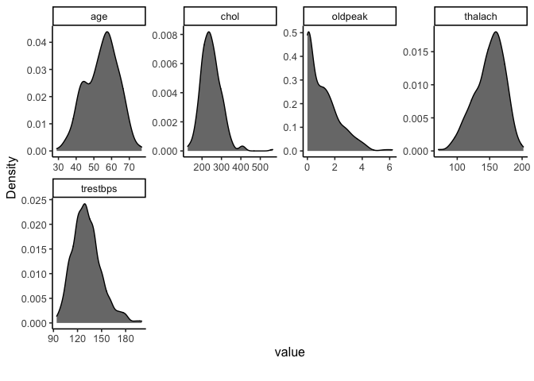<!-- -->

``` r
plot_bar(df, ggtheme = theme_classic2())
```

<!-- -->

The next step is to combine dplyr and Data Explorer libraries to
visualize the variables according to gender and disease.

### B Analyze each variable per gender

``` r
df %>%
  filter(sex == "female") %>%
  plot_density(ggtheme = theme_classic2(), geom_density_args = list("fill" = "black", "alpha" = 0.6))
```

<!-- -->

``` r
df %>%
  filter(sex == "male") %>%
  plot_density(ggtheme = theme_classic2(), geom_density_args = list("fill" = "black", "alpha" = 0.6))
```

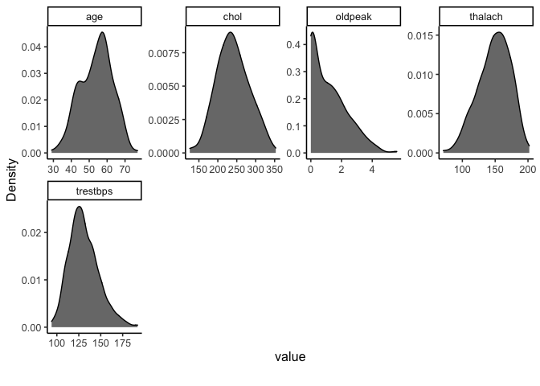<!-- -->

``` r
df %>%
  filter(sex == "female") %>%
  plot_bar(ggtheme = theme_classic2())
```

<!-- -->

``` r
df %>%
  filter(sex == "male") %>%
  plot_bar(ggtheme = theme_classic2())
```

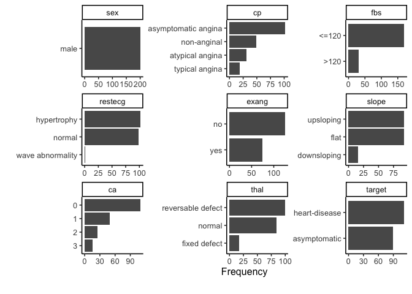<!-- -->

### C Visualize variables per disease status

``` r
df %>%
  filter(target == "asymptomatic") %>%
  plot_density(ggtheme = theme_classic2(), geom_density_args = list("fill" = "black", "alpha" = 0.6))
```

<!-- -->

``` r
df %>%
  filter(target == "heart-disease") %>%
  plot_density(ggtheme = theme_classic2(), geom_density_args = list("fill" = "black", "alpha" = 0.6))
```

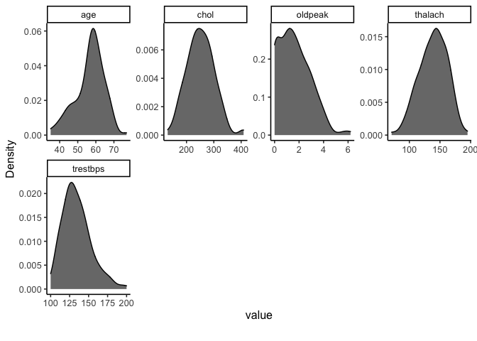<!-- -->

``` r
df %>%
  filter(target == "asymptomatic") %>%
  plot_bar(ggtheme = theme_classic2())
```

<!-- -->

``` r
df %>%
  filter(target == "heart-disease") %>%
  plot_bar(ggtheme = theme_classic2())
```

<!-- -->

### Visualize the data per gender and disease status

``` r
df %>%
  filter(sex == "female", target == "asymptomatic") %>%
  plot_density(ggtheme = theme_classic2(), geom_density_args = list("fill" = "black", "alpha" = 0.6))
```

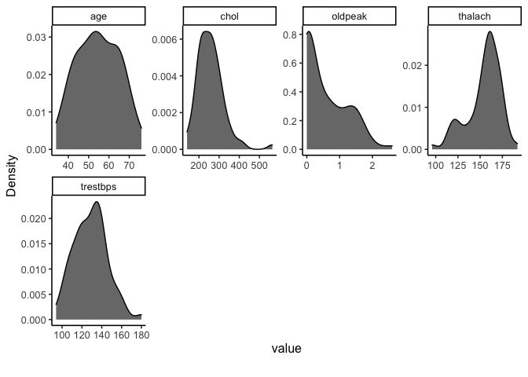<!-- -->

``` r
df %>%
  filter(sex == "female", target == "heart-disease") %>%
  plot_density(ggtheme = theme_classic2(), geom_density_args = list("fill" = "black", "alpha" = 0.6))
```

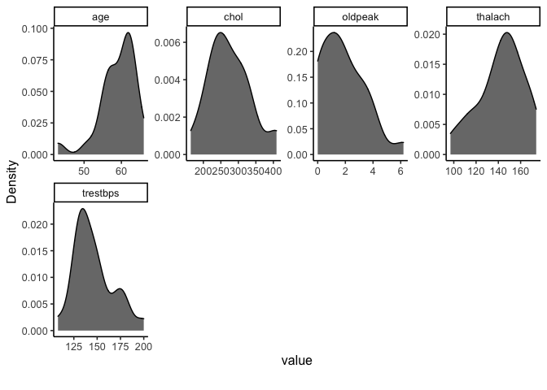<!-- -->

``` r
df %>%
  filter(sex == "female", target == "asymptomatic") %>%
  plot_bar(ggtheme = theme_classic2())
```

<!-- -->

``` r
df %>%
  filter(sex == "female", target == "heart-disease") %>%
  plot_bar(ggtheme = theme_classic2())
```

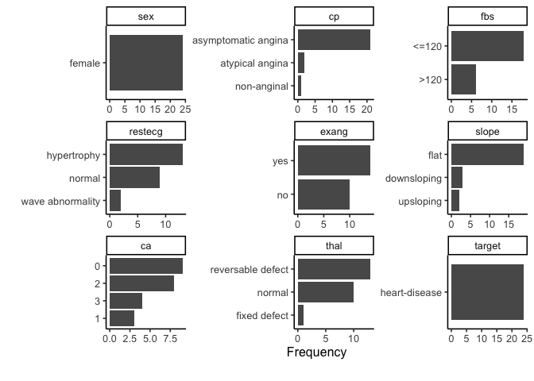<!-- -->

``` r
df %>%
  filter(sex == "male", target == "asymptomatic") %>%
  plot_density(ggtheme = theme_classic2(), geom_density_args = list("fill" = "black", "alpha" = 0.6))
```

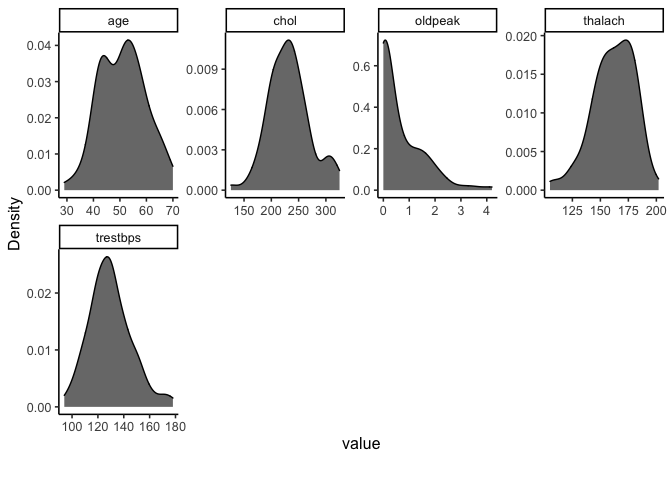<!-- -->

``` r
df %>%
  filter(sex == "male", target == "heart-disease") %>%
  plot_density(ggtheme = theme_classic2(), geom_density_args = list("fill" = "black", "alpha" = 0.6))
```

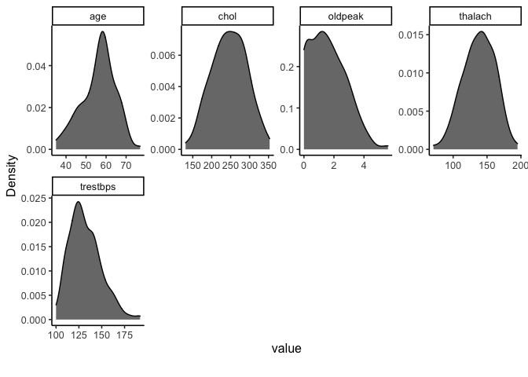<!-- -->

``` r
df %>%
  filter(sex == "male", target == "asymptomatic") %>%
  plot_bar(ggtheme = theme_classic2())
```

<!-- -->

``` r
df %>%
  filter(sex == "male", target == "heart-disease") %>%
  plot_bar(ggtheme = theme_classic2())
```

<!-- -->

### Prepare a summary table per disease and gender

``` r
df %>%
  group_by(target, sex) %>%
  summarise(
    n_disease = n(),
    mean_age = round(mean(age), digits=2),
    sd_age = round(sd(age), digits=2),
    mean_trestbps = round(mean(trestbps), digits=2),
    sd_trestbps = round(sd(trestbps), digits=2),
    mean_chol = round(mean(chol), digits=2),
    sd_chol = round(sd(chol), digits=2),
    mean_thalach = round(mean(thalach), digits=2),
    sd_thalach = round(sd(thalach), digits=2),
    mean_oldpeak = round(mean(oldpeak), digits=2),
    sd_oldpeak = round(sd(oldpeak), digits=2)
  )
```

    ## `summarise()` has grouped output by 'target'. You can override using the `.groups` argument.

    ## # A tibble: 4 x 13
    ## # Groups:   target [2]
    ##   target sex   n_disease mean_age sd_age mean_trestbps sd_trestbps mean_chol
    ##   <chr>  <fct>     <int>    <dbl>  <dbl>         <dbl>       <dbl>     <dbl>
    ## 1 asymp… fema…        71     54.6  10.3           129.        16.6      257.
    ## 2 asymp… male         89     51.1   8.63          130.        16.2      232.
    ## 3 heart… fema…        24     59.0   4.96          146.        21.4      275.
    ## 4 heart… male        112     56.2   8.36          132.        17.4      246.
    ## # … with 5 more variables: sd_chol <dbl>, mean_thalach <dbl>, sd_thalach <dbl>,
    ## #   mean_oldpeak <dbl>, sd_oldpeak <dbl>

## IV Data Visualization

From the Exploratory Data analysis, it seems that several differences
are statistically significant according to gender and health status.

### A Visualization of variables per gender

``` r
# Male and Female count
a1 <- ggplot(df, aes(x = sex, fill = sex)) +
  geom_bar(width = 0.5) + 
  scale_fill_manual(values = c("#386cb0","#fdb462"))+
  theme_classic2() +
  theme(legend.position='none')

# Age per gender
b1 <- ggplot(df, aes(x= sex, y = age, fill = sex)) +
  geom_violin(width = 0.5) +
  geom_boxplot(width = 0.2) +
  ylim(0, 90) +
  stat_compare_means(aes(label = ..p.signif..), method = "t.test") +
  scale_fill_manual(values = c("#386cb0","#fdb462"))+
  theme_classic2() +
  theme(legend.position='none')

# trestbps
c1 <- ggplot(df, aes(x = sex, y = trestbps, fill = sex)) +
  geom_violin(width = 0.5) +
  geom_boxplot(width = 0.2) + 
  labs(y = "blood pressure (mmHg)") +
  ylim(0,250) +
  stat_compare_means(aes(label = ..p.signif..), method = "t.test") +
  scale_fill_manual(values = c("#386cb0","#fdb462"))+
  theme_classic2() +
  theme(legend.position='none')

# chol
d1 <- ggplot(df, aes(x = sex, y = chol, fill = sex)) +
  geom_violin(width = 0.5) +
  geom_boxplot(width = 0.2) + 
  labs(y = "cholestorol (mg/dl)") +
  ylim(0,500) +
  stat_compare_means(aes(label = ..p.signif..), method = "t.test") +
  scale_fill_manual(values = c("#386cb0","#fdb462"))+
  theme_classic2() +
  theme(legend.position='none')

# oldpeak
e1 <- ggplot(df, aes(x = sex, y = oldpeak, fill = sex)) +
  geom_violin(width = 0.5) +
  geom_boxplot(width = 0.2) + 
  labs(y = "ST depression") +
  ylim(0,10) +
  stat_compare_means(aes(label = ..p.signif..), method = "t.test") +
  scale_fill_manual(values = c("#386cb0","#fdb462"))+
  theme_classic2() +
  theme(legend.position='none')

# thalach
f1 <- ggplot(df, aes(x = sex, y = thalach, fill = sex)) +
  geom_violin(width = 0.5) +
  geom_boxplot(width = 0.2) + 
  labs(y = "Max. heart rate") +
  ylim(0,250) +
  stat_compare_means(aes(label = ..p.signif..), method = "t.test") +
  scale_fill_manual(values = c("#386cb0","#fdb462"))+
  theme_classic2() +
  theme(legend.position='none')

suppressWarnings(ggarrange(a1, b1, c1, d1, e1, f1, 
          ncol = 2, nrow = 3,
            align = "v"))
```

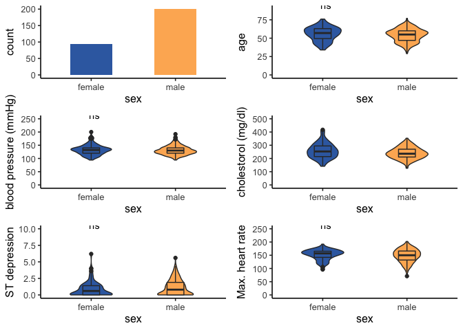<!-- -->

``` r
# Disease status
g1 <- ggplot(df, aes(x = target, fill = sex)) +
  geom_bar(width = 0.5, position = 'dodge') + 
  labs(x = "") +
  coord_flip() +
  scale_fill_manual(values = c("#386cb0","#fdb462"))+
  theme_classic2() +
  theme(legend.position='none')

# cp
h1 <- ggplot(df, aes(cp, group = sex, fill = sex)) +
  geom_bar(position = "dodge") +
  labs(x = "", y = "chest pain") +
  coord_flip() +
  scale_fill_manual(values = c("#386cb0","#fdb462"))+
  theme_classic2() +
  theme(legend.position='none')

# restecg
i1 <- ggplot(df, aes(restecg, group = sex, fill = sex)) +
  geom_bar(position = "dodge") +
  labs(x = "", y = "rest. electrocardiographic") +
  coord_flip() +
  scale_fill_manual(values = c("#386cb0","#fdb462"))+
  theme_classic2() +
  theme(legend.position='none')

# slope
j1 <- ggplot(df, aes(slope, group = sex, fill = sex)) +
  geom_bar(position = "dodge") +
  labs(x = "", y = "peak exercise ST") +
  coord_flip() +
  scale_fill_manual(values = c("#386cb0","#fdb462"))+
  theme_classic2() +
  theme(legend.position='none')

# thal 
k1 <- ggplot(df, aes(thal, group = sex, fill = sex)) +
  geom_bar(position = "dodge") +
  labs(x = "", y = "Thalium stress test") +
  coord_flip() +
  scale_fill_manual(values = c("#386cb0","#fdb462"))+
  theme_classic2() +
  theme(legend.position='none')

# fbp
l1 <- ggplot(df, aes(fbs, group = sex, fill = sex)) +
  geom_bar(position = "dodge") +
  labs(x = "", y = "Fasting blood sugar") +
  coord_flip() +
  scale_fill_manual(values = c("#386cb0","#fdb462"))+
  theme_classic2() +
  theme(legend.position='none')

# exang
m1 <- ggplot(df, aes(exang, group = sex, fill = sex)) +
  geom_bar(position = "dodge") +
  labs(x = "", y = "Exercise induced angina") +
  coord_flip() +
  scale_fill_manual(values = c("#386cb0","#fdb462"))+
  theme_classic2() +
  theme(legend.position='none')

# ca
n1 <- ggplot(df, aes(ca, group = sex, fill = sex)) +
  geom_bar(position = "dodge") +
  labs(x = "", y = "flourosopy") +
  coord_flip() +
  scale_fill_manual(values = c("#386cb0","#fdb462"))+
  theme_classic2() +
  theme(legend.position='none')

ggarrange(g1, h1, i1, j1, k1, l1, m1, n1, 
          ncol = 2, nrow = 4,
          align = "v")
```

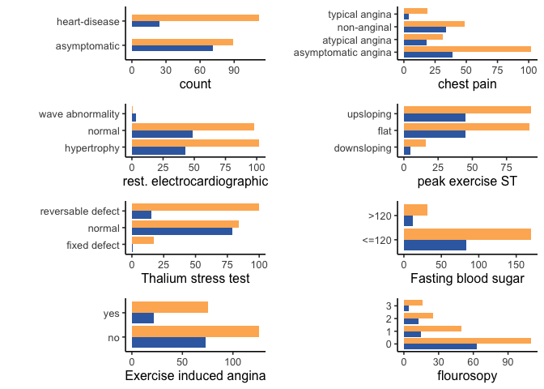<!-- -->

**From this first plot, it appears that this dataset contains more males
patients with a higher proportion of heart disease compared to female
patients.**

### B Visualization of variables per disease status

#### 1 Male patient

``` r
df <- df2 %>%
    filter(sex == "male")
```

``` r
# Male and Female count
a2 <- ggplot(df, aes(x = target, fill = target)) +
  geom_bar(width = 0.5, position = 'dodge') + 
  scale_fill_manual(values = c("#7fc97f","#ef3b2c"))+
  theme_classic2() +
  theme(legend.position='none')

# Age per gender
b2 <- ggplot(df, aes(x= target, y = age, fill = target)) +
  geom_violin(width = 0.5) +
  geom_boxplot(width = 0.2) +
  ylim(0, 90) +
  stat_compare_means(aes(label = ..p.signif..), method = "t.test") +
  scale_fill_manual(values = c("#7fc97f","#ef3b2c"))+
  theme_classic2() +
  theme(legend.position='none')

# trestbps
c2 <- ggplot(df, aes(x = target, y = trestbps, fill = target)) +
  geom_violin(width = 0.5) +
  geom_boxplot(width = 0.2) + 
  labs(y = "blood pressure (mmHg)") +
  ylim(0,250) +
 stat_compare_means(aes(label = ..p.signif..), method = "t.test") +
  scale_fill_manual(values = c("#7fc97f","#ef3b2c"))+
  theme_classic2() +
  theme(legend.position='none')

# chol
d2 <- ggplot(df, aes(x = target, y = chol, fill = target)) +
  geom_violin(width = 0.5) +
  geom_boxplot(width = 0.2) + 
  labs(y = "cholestorol (mg/dl)") +
  ylim(0,500) +
  stat_compare_means(aes(label = ..p.signif..), method = "t.test") +
  scale_fill_manual(values = c("#7fc97f","#ef3b2c"))+
  theme_classic2() +
  theme(legend.position='none')

# oldpeak
e2 <- ggplot(df, aes(x = target, y = oldpeak, fill = target)) +
  geom_violin(width = 0.5) +
  geom_boxplot(width = 0.2) + 
  labs(y = "ST depression") +
  ylim(0,10) +
  stat_compare_means(aes(label = ..p.signif..), method = "t.test") +
  scale_fill_manual(values = c("#7fc97f","#ef3b2c"))+
  theme_classic2() +
  theme(legend.position='none')

# thalach
f2 <- ggplot(df, aes(x = target, y = thalach, fill = target)) +
  geom_violin(width = 0.5) +
  geom_boxplot(width = 0.2) + 
  labs(y = "Max. heart rate") +
  ylim(0,250) +
  stat_compare_means(aes(label = ..p.signif..), method = "t.test") +
  scale_fill_manual(values = c("#7fc97f","#ef3b2c"))+
  theme_classic2() +
  theme(legend.position='none')

ggarrange(a2, b2, c2, d2, e2, f2, 
          ncol = 2, nrow = 3,
            align = "v")
```

<!-- -->

**Male patients with heart disease are significantly older, have higher
cholesterol level, and reduced maximum heart rate response to the
thallium test. **

``` r
# Disease status
g2 <- ggplot(df, aes(x = target, fill = target)) +
  geom_bar(width = 0.5, position = 'dodge') + 
  labs(x = "") +
  coord_flip() +
  scale_fill_manual(values = c("#7fc97f","#ef3b2c"))+
  theme_classic2() +
  theme(legend.position='none')

# cp
h2 <- ggplot(df, aes(cp, group = target, fill = target)) +
  geom_bar(position = "dodge") +
  labs(x = "", y = "chest pain") +
  coord_flip() +
  scale_fill_manual(values = c("#7fc97f","#ef3b2c"))+
  theme_classic2() +
  theme(legend.position='none')

# restecg
i2 <- ggplot(df, aes(restecg, group = target, fill = target)) +
  geom_bar(position = "dodge") +
  labs(x = "", y = "rest. electrocardiographic") +
  coord_flip() +
  scale_fill_manual(values = c("#7fc97f","#ef3b2c"))+
  theme_classic2() +
  theme(legend.position='none')

# slope
j2 <- ggplot(df, aes(slope, group = target, fill = target)) +
  geom_bar(position = "dodge") +
  labs(x = "", y = "peak exercise ST") +
  coord_flip() +
  scale_fill_manual(values = c("#7fc97f","#ef3b2c"))+
  theme_classic2() +
  theme(legend.position='none')

# thal 
k2 <- ggplot(df, aes(thal, group = target, fill = target)) +
  geom_bar(position = "dodge") +
  labs(x = "", y = "Thalium stress test") +
  coord_flip() +
  scale_fill_manual(values = c("#7fc97f","#ef3b2c"))+
  theme_classic2() +
  theme(legend.position='none')

# fbp
l2 <- ggplot(df, aes(fbs, group = target, fill = target)) +
  geom_bar(position = "dodge") +
  labs(x = "", y = "Fasting blood sugar") +
  coord_flip() +
  scale_fill_manual(values = c("#7fc97f","#ef3b2c"))+
  theme_classic2() +
  theme(legend.position='none')

# exang
m2 <- ggplot(df, aes(exang, group = target, fill = target)) +
  geom_bar(position = "dodge") +
  labs(x = "", y = "Exercise induced angina") +
  coord_flip() +
  scale_fill_manual(values = c("#7fc97f","#ef3b2c"))+
  theme_classic2() +
  theme(legend.position='none')

# ca
n2 <- ggplot(df, aes(ca, group = target, fill = target)) +
  geom_bar(position = "dodge") +
  labs(x = "", y = "flourosopy") +
  coord_flip() +
  scale_fill_manual(values = c("#7fc97f","#ef3b2c"))+
  theme_classic2() +
  theme(legend.position='none')

ggarrange(g2, h2, i2, j2, k2, l2, m2, n2, 
          ncol = 2, nrow = 4,
          align = "v")
```

<!-- -->

#### 2 Female patients

``` r
df <- df2 %>%
    filter(sex == "female")
```

``` r
# Male and Female count
a2 <- ggplot(df, aes(x = target, fill = target)) +
  geom_bar(width = 0.5, position = 'dodge') + 
  scale_fill_manual(values = c("#7fc97f","#ef3b2c"))+
  theme_classic2() +
  theme(legend.position='none')

# Age per gender
b2 <- ggplot(df, aes(x= target, y = age, fill = target)) +
  geom_violin(width = 0.5) +
  geom_boxplot(width = 0.2) +
  ylim(0, 90) +
  stat_compare_means(aes(label = ..p.signif..), method = "t.test") +
  scale_fill_manual(values = c("#7fc97f","#ef3b2c"))+
  theme_classic2() +
  theme(legend.position='none')

# trestbps
c2 <- ggplot(df, aes(x = target, y = trestbps, fill = target)) +
  geom_violin(width = 0.5) +
  geom_boxplot(width = 0.2) + 
  labs(y = "blood pressure (mmHg)") +
  ylim(0,250) +
  stat_compare_means(aes(label = ..p.signif..), method = "t.test") +
  scale_fill_manual(values = c("#7fc97f","#ef3b2c"))+
  theme_classic2() +
  theme(legend.position='none')

# chol
d2 <- ggplot(df, aes(x = target, y = chol, fill = target)) +
  geom_violin(width = 0.5) +
  geom_boxplot(width = 0.2) + 
  labs(y = "cholestorol (mg/dl)") +
  ylim(0,500) +
  stat_compare_means(aes(label = ..p.signif..), method = "t.test") +
  scale_fill_manual(values = c("#7fc97f","#ef3b2c"))+
  theme_classic2() +
  theme(legend.position='none')

# oldpeak
e2 <- ggplot(df, aes(x = target, y = oldpeak, fill = target)) +
  geom_violin(width = 0.5) +
  geom_boxplot(width = 0.2) + 
  labs(y = "ST depression") +
  ylim(0,10) +
  stat_compare_means(aes(label = ..p.signif..), method = "t.test") +
  scale_fill_manual(values = c("#7fc97f","#ef3b2c"))+
  theme_classic2() +
  theme(legend.position='none')

# thalach
f2 <- ggplot(df, aes(x = target, y = thalach, fill = target)) +
  geom_violin(width = 0.5) +
  geom_boxplot(width = 0.2) + 
  labs(y = "Max. heart rate") +
  ylim(0,250) +
  stat_compare_means(aes(label = ..p.signif..), method = "t.test") +
  scale_fill_manual(values = c("#7fc97f","#ef3b2c"))+
  theme_classic2() +
  theme(legend.position='none')

suppressWarnings(ggarrange(a2, b2, c2, d2, e2, f2, 
          ncol = 2, nrow = 3,
            align = "v"))
```

<!-- -->

**There is less woman with heart disease on this data set. Women with
heart disease have a significantly higher resting blood presure contrary
to male with heart disease. Similarly to men, women with heart disease
have a lower maximum heart rate in response to the thallium test. **

``` r
# Disease status
g2 <- ggplot(df, aes(x = target, fill = target)) +
  geom_bar(width = 0.5, position = 'dodge') + 
  labs(x = "") +
  coord_flip() +
  scale_fill_manual(values = c("#7fc97f","#ef3b2c"))+
  theme_classic2() +
  theme(legend.position='none')

# cp
h2 <- ggplot(df, aes(cp, group = target, fill = target)) +
  geom_bar(position = "dodge") +
  labs(x = "", y = "chest pain") +
  coord_flip() +
  scale_fill_manual(values = c("#7fc97f","#ef3b2c"))+
  theme_classic2() +
  theme(legend.position='none')

# restecg
i2 <- ggplot(df, aes(restecg, group = target, fill = target)) +
  geom_bar(position = "dodge") +
  labs(x = "", y = "rest. electrocardiographic") +
  coord_flip() +
  scale_fill_manual(values = c("#7fc97f","#ef3b2c"))+
  theme_classic2() +
  theme(legend.position='none')

# slope
j2 <- ggplot(df, aes(slope, group = target, fill = target)) +
  geom_bar(position = "dodge") +
  labs(x = "", y = "peak exercise ST") +
  coord_flip() +
  scale_fill_manual(values = c("#7fc97f","#ef3b2c"))+
  theme_classic2() +
  theme(legend.position='none')

# thal 
k2 <- ggplot(df, aes(thal, group = target, fill = target)) +
  geom_bar(position = "dodge") +
  labs(x = "", y = "Thalium stress test") +
  coord_flip() +
  scale_fill_manual(values = c("#7fc97f","#ef3b2c"))+
  theme_classic2() +
  theme(legend.position='none')

# fbp
l2 <- ggplot(df, aes(fbs, group = target, fill = target)) +
  geom_bar(position = "dodge") +
  labs(x = "", y = "Fasting blood sugar") +
  coord_flip() +
  scale_fill_manual(values = c("#7fc97f","#ef3b2c"))+
  theme_classic2() +
  theme(legend.position='none')

# exang
m2 <- ggplot(df, aes(exang, group = target, fill = target)) +
  geom_bar(position = "dodge") +
  labs(x = "", y = "Exercise induced angina") +
  coord_flip() +
  scale_fill_manual(values = c("#7fc97f","#ef3b2c"))+
  theme_classic2() +
  theme(legend.position='none')

# ca
n2 <- ggplot(df, aes(ca, group = target, fill = target)) +
  geom_bar(position = "dodge") +
  labs(x = "", y = "flourosopy") +
  coord_flip() +
  scale_fill_manual(values = c("#7fc97f","#ef3b2c"))+
  theme_classic2() +
  theme(legend.position='none')

ggarrange(g2, h2, i2, j2, k2, l2, m2, n2, 
          ncol = 2, nrow = 4,
          align = "v")
```

<!-- -->

## V Correlations

### A use the numerical dataset

``` r
df <- copy %>%
  filter(
    thal != 0 & ca != 4 # remove values correspondind to NA in original dataset
    )
```

``` r
# ggcorr(df, palette = "RdBu")
GGally::ggcorr(df, geom = "circle")
```

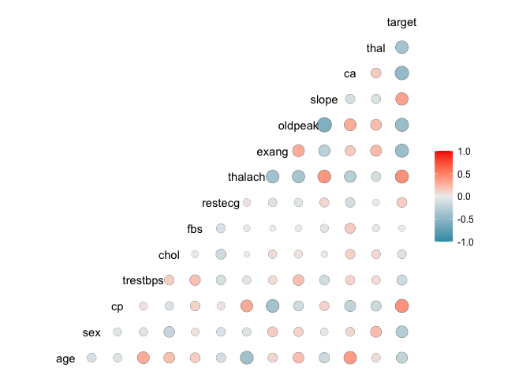<!-- -->

``` r
select2 <- df %>%
  dplyr::select(
    target,
    slope,
    thalach,
    restecg,
    cp
  )
```

``` r
ggcorr(select2, geom = "circle")
```

<!-- -->

``` r
ggpairs(df)
```

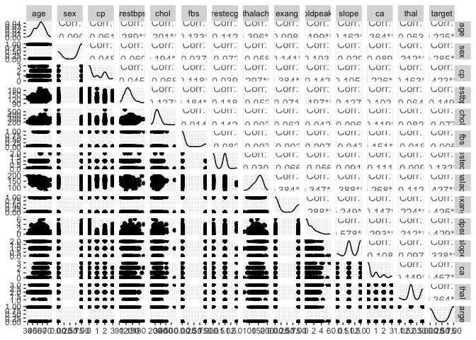<!-- -->

``` r
ggpairs(select2)
```

<!-- -->

From the correlation study it seems that the parameters  
\* cp  
\* restecg  
\* thalach  
\* slope  
are the most usefull to predict the risk of heart disease

From the EDA anlysis it semms that  
\* age  
\* sex  
\* cholesterol  
\* restecg  
are also usefull

For prediction the following variables seems the most usefull  
\* age  
\* sex  
\* cholesterol  
\* restecg  
\* cp  
\* thalach  
\* slope

## VI Machine Learning: classification model with rpart and random forest packages

1.  Select the columns usefull for prediction according to the EDA
    analysis.  
2.  Separate the data set in a train and test subsets.  
3.  Build a classification tree model with rpart.  
4.  Print model accuracy and descision tree.

### A Use select columns for classification

``` r
df_select <- df %>%
  dplyr::select( #because of conflict between MASS and dplyr select need to use dplyr::select
    target,
    age,
    sex,
    chol,
    restecg,
    cp,
    thalach,
    slope
  )
```

``` r
df_select$target <- factor(df_select$target) # Define target as a factor. rpart classification would not work otherwise.

accuracy <- 0

# Build a simple classification desicion tree with rpart. Run the model until the accuracy reach the selected minimum.
while(accuracy <= 0.85) {
  split_values <- sample.split(df_select$target, SplitRatio = 0.65)
  train_set <- subset(df_select, split_values == T)
  test_set <- subset(df_select, split_values == F)
  mod_class <- rpart(target~. , data=train_set)
  result_class <- predict(mod_class, test_set, type = "class")
  table <- table(test_set$target, result_class)
  accuracy <- (table["0","0"] + table["1","1"])/sum(table)
  # cat("accuracy = ", round(accuracy, digits = 2)*100, "%")
}
```

Print model accuracy.  
According to parameters the model should be at least 88% accurate.

``` r
cat("Model accuracy", round(accuracy, digits = 2)*100, "%")  
```

    ## Model accuracy 86 %

Print the desicion tree.

``` r
# par(mfrow = c(1,2), xpd = NA) # otherwise on some devices the text is clipped
fancyRpartPlot(mod_class, , caption = NULL)
```

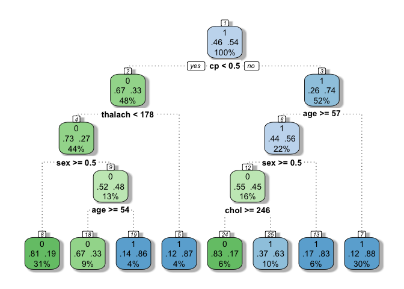<!-- -->

``` r
# plot(mod_class)
# text(mod_class, use.n = TRUE)
```

### B Use the full dataset for classification

``` r
copy2 <- df
df$target <- factor(df$target)
accuracy <- 0

# Build a simple classification desicion tree with rpart. Run the model until the accuracy reach the selected minimum.
while(accuracy <= 0.88) {
  split_values <- sample.split(df_select$target, SplitRatio = 0.65)
  train_set <- subset(df, split_values == T)
  test_set <- subset(df, split_values == F)
  mod_class <- rpart(target~. , data=train_set)
  result_class <- predict(mod_class, test_set, type = "class")
  table <- table(test_set$target, result_class)
  accuracy <- (table["0","0"] + table["1","1"])/sum(table)
  # cat("accuracy = ", round(accuracy, digits = 2)*100, "%")
}
```

Print model accuracy.  
According to parameters the model should be at least 88% accurate.

``` r
cat("Model accuracy", round(accuracy, digits = 2)*100, "%")  
```

    ## Model accuracy 89 %

Print the desicion tree.

``` r
# par(mfrow = c(1,2), xpd = NA) # otherwise on some devices the text is clipped
fancyRpartPlot(mod_class, , caption = NULL)
```

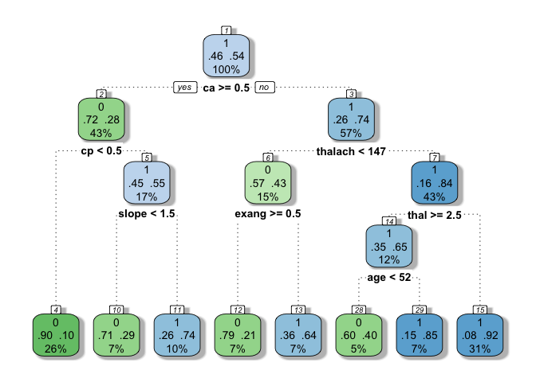<!-- -->

``` r
# plot(mod_class)
# text(mod_class, use.n = TRUE)
```

### C Prediction on selected column with random forest

``` r
set.seed(123)
train <- sample(nrow(df_select), 0.7*nrow(df_select), replace = FALSE)
TrainSet <- df_select[train,]
ValidSet <- df_select[-train,]
summary(TrainSet)
```

    ##  target       age             sex              chol        restecg      
    ##  0: 91   Min.   :29.00   Min.   :0.0000   Min.   :126   Min.   :0.0000  
    ##  1:116   1st Qu.:48.00   1st Qu.:0.0000   1st Qu.:208   1st Qu.:0.0000  
    ##          Median :56.00   Median :1.0000   Median :240   Median :0.0000  
    ##          Mean   :55.02   Mean   :0.6763   Mean   :244   Mean   :0.5024  
    ##          3rd Qu.:62.00   3rd Qu.:1.0000   3rd Qu.:272   3rd Qu.:1.0000  
    ##          Max.   :77.00   Max.   :1.0000   Max.   :564   Max.   :2.0000  
    ##        cp           thalach          slope      
    ##  Min.   :0.000   Min.   : 95.0   Min.   :0.000  
    ##  1st Qu.:0.000   1st Qu.:136.0   1st Qu.:1.000  
    ##  Median :1.000   Median :153.0   Median :1.000  
    ##  Mean   :1.014   Mean   :150.2   Mean   :1.386  
    ##  3rd Qu.:2.000   3rd Qu.:165.0   3rd Qu.:2.000  
    ##  Max.   :3.000   Max.   :202.0   Max.   :2.000

``` r
summary(ValidSet)
```

    ##  target      age             sex              chol          restecg     
    ##  0:45   Min.   :35.00   Min.   :0.0000   Min.   :175.0   Min.   :0.000  
    ##  1:44   1st Qu.:47.00   1st Qu.:0.0000   1st Qu.:223.0   1st Qu.:0.000  
    ##         Median :54.00   Median :1.0000   Median :247.0   Median :1.000  
    ##         Mean   :53.37   Mean   :0.6854   Mean   :254.5   Mean   :0.573  
    ##         3rd Qu.:59.00   3rd Qu.:1.0000   3rd Qu.:283.0   3rd Qu.:1.000  
    ##         Max.   :70.00   Max.   :1.0000   Max.   :409.0   Max.   :2.000  
    ##        cp            thalach          slope      
    ##  Min.   :0.0000   Min.   : 71.0   Min.   :0.000  
    ##  1st Qu.:0.0000   1st Qu.:132.0   1st Qu.:1.000  
    ##  Median :0.0000   Median :152.0   Median :1.000  
    ##  Mean   :0.8315   Mean   :148.2   Mean   :1.416  
    ##  3rd Qu.:2.0000   3rd Qu.:168.0   3rd Qu.:2.000  
    ##  Max.   :3.0000   Max.   :190.0   Max.   :2.000

``` r
# Create a Random Forest model with default parameters
model1 <- randomForest(target ~ ., data = TrainSet,  ntree = 1000, mtry = 1, importance = TRUE)
model1
```

    ## 
    ## Call:
    ##  randomForest(formula = target ~ ., data = TrainSet, ntree = 1000,      mtry = 1, importance = TRUE) 
    ##                Type of random forest: classification
    ##                      Number of trees: 1000
    ## No. of variables tried at each split: 1
    ## 
    ##         OOB estimate of  error rate: 28.02%
    ## Confusion matrix:
    ##    0  1 class.error
    ## 0 58 33   0.3626374
    ## 1 25 91   0.2155172

``` r
# Predicting on train set
predTrain <- predict(model1, TrainSet, type = "class")
# Checking classification accuracy
table(predTrain, TrainSet$target) 
```

    ##          
    ## predTrain   0   1
    ##         0  80   9
    ##         1  11 107

``` r
# Predicting on Validation set
predValid <- predict(model1, ValidSet, type = "class")
# Checking classification accuracy
mean(predValid == ValidSet$target)                    
```

    ## [1] 0.7977528

``` r
table(predValid,ValidSet$target)
```

    ##          
    ## predValid  0  1
    ##         0 36  9
    ##         1  9 35

``` r
# To check important variables
importance(model1)        
```

    ##                 0            1 MeanDecreaseAccuracy MeanDecreaseGini
    ## age      3.456978 11.118814352            10.045334        10.174882
    ## sex     17.986950 18.447097660            22.356657         6.212641
    ## chol    -3.667658 -0.005187581            -2.378170         9.368247
    ## restecg  1.926634  3.951377314             4.138125         3.080821
    ## cp      19.676722 17.420672992            22.537720        10.408636
    ## thalach 14.987882 12.899451821            18.350082        14.006896
    ## slope   13.982290  9.048798817            15.232708         6.022085

``` r
varImpPlot(model1)  
```

<!-- -->

### D Use the full dataset for classification with random forest

``` r
set.seed(123)
train <- sample(nrow(df), 0.7*nrow(df_select), replace = FALSE)
TrainSet <- df[train,]
ValidSet <- df[-train,]
summary(TrainSet)
```

    ##       age             sex               cp           trestbps          chol    
    ##  Min.   :29.00   Min.   :0.0000   Min.   :0.000   Min.   :100.0   Min.   :126  
    ##  1st Qu.:48.00   1st Qu.:0.0000   1st Qu.:0.000   1st Qu.:120.0   1st Qu.:208  
    ##  Median :56.00   Median :1.0000   Median :1.000   Median :130.0   Median :240  
    ##  Mean   :55.02   Mean   :0.6763   Mean   :1.014   Mean   :131.1   Mean   :244  
    ##  3rd Qu.:62.00   3rd Qu.:1.0000   3rd Qu.:2.000   3rd Qu.:140.0   3rd Qu.:272  
    ##  Max.   :77.00   Max.   :1.0000   Max.   :3.000   Max.   :192.0   Max.   :564  
    ##       fbs            restecg          thalach          exang       
    ##  Min.   :0.0000   Min.   :0.0000   Min.   : 95.0   Min.   :0.0000  
    ##  1st Qu.:0.0000   1st Qu.:0.0000   1st Qu.:136.0   1st Qu.:0.0000  
    ##  Median :0.0000   Median :0.0000   Median :153.0   Median :0.0000  
    ##  Mean   :0.1643   Mean   :0.5024   Mean   :150.2   Mean   :0.3382  
    ##  3rd Qu.:0.0000   3rd Qu.:1.0000   3rd Qu.:165.0   3rd Qu.:1.0000  
    ##  Max.   :1.0000   Max.   :2.0000   Max.   :202.0   Max.   :1.0000  
    ##     oldpeak          slope             ca              thal       target 
    ##  Min.   :0.000   Min.   :0.000   Min.   :0.0000   Min.   :1.000   0: 91  
    ##  1st Qu.:0.000   1st Qu.:1.000   1st Qu.:0.0000   1st Qu.:2.000   1:116  
    ##  Median :0.800   Median :1.000   Median :0.0000   Median :2.000          
    ##  Mean   :1.055   Mean   :1.386   Mean   :0.6039   Mean   :2.319          
    ##  3rd Qu.:1.600   3rd Qu.:2.000   3rd Qu.:1.0000   3rd Qu.:3.000          
    ##  Max.   :6.200   Max.   :2.000   Max.   :3.0000   Max.   :3.000

``` r
summary(ValidSet)
```

    ##       age             sex               cp            trestbps    
    ##  Min.   :35.00   Min.   :0.0000   Min.   :0.0000   Min.   : 94.0  
    ##  1st Qu.:47.00   1st Qu.:0.0000   1st Qu.:0.0000   1st Qu.:120.0  
    ##  Median :54.00   Median :1.0000   Median :0.0000   Median :130.0  
    ##  Mean   :53.37   Mean   :0.6854   Mean   :0.8315   Mean   :132.8  
    ##  3rd Qu.:59.00   3rd Qu.:1.0000   3rd Qu.:2.0000   3rd Qu.:146.0  
    ##  Max.   :70.00   Max.   :1.0000   Max.   :3.0000   Max.   :200.0  
    ##       chol            fbs            restecg         thalach     
    ##  Min.   :175.0   Min.   :0.0000   Min.   :0.000   Min.   : 71.0  
    ##  1st Qu.:223.0   1st Qu.:0.0000   1st Qu.:0.000   1st Qu.:132.0  
    ##  Median :247.0   Median :0.0000   Median :1.000   Median :152.0  
    ##  Mean   :254.5   Mean   :0.1011   Mean   :0.573   Mean   :148.2  
    ##  3rd Qu.:283.0   3rd Qu.:0.0000   3rd Qu.:1.000   3rd Qu.:168.0  
    ##  Max.   :409.0   Max.   :1.0000   Max.   :2.000   Max.   :190.0  
    ##      exang           oldpeak          slope             ca        
    ##  Min.   :0.0000   Min.   :0.000   Min.   :0.000   Min.   :0.0000  
    ##  1st Qu.:0.0000   1st Qu.:0.000   1st Qu.:1.000   1st Qu.:0.0000  
    ##  Median :0.0000   Median :0.800   Median :1.000   Median :1.0000  
    ##  Mean   :0.3034   Mean   :1.069   Mean   :1.416   Mean   :0.8539  
    ##  3rd Qu.:1.0000   3rd Qu.:1.900   3rd Qu.:2.000   3rd Qu.:1.0000  
    ##  Max.   :1.0000   Max.   :4.400   Max.   :2.000   Max.   :3.0000  
    ##       thal       target
    ##  Min.   :1.000   0:45  
    ##  1st Qu.:2.000   1:44  
    ##  Median :2.000         
    ##  Mean   :2.348         
    ##  3rd Qu.:3.000         
    ##  Max.   :3.000

``` r
# Create a Random Forest model with default parameters
model2 <- randomForest(target ~ ., data = TrainSet,  ntree = 1000, mtry = 2, importance = TRUE)
model2
```

    ## 
    ## Call:
    ##  randomForest(formula = target ~ ., data = TrainSet, ntree = 1000,      mtry = 2, importance = TRUE) 
    ##                Type of random forest: classification
    ##                      Number of trees: 1000
    ## No. of variables tried at each split: 2
    ## 
    ##         OOB estimate of  error rate: 20.77%
    ## Confusion matrix:
    ##    0   1 class.error
    ## 0 63  28   0.3076923
    ## 1 15 101   0.1293103

``` r
# Predicting on train set
predTrain <- predict(model2, TrainSet, type = "class")
# Checking classification accuracy
table(predTrain, TrainSet$target) 
```

    ##          
    ## predTrain   0   1
    ##         0  91   0
    ##         1   0 116

``` r
# Predicting on Validation set
predValid <- predict(model2, ValidSet, type = "class")
# Checking classification accuracy
mean(predValid == ValidSet$target)                    
```

    ## [1] 0.8764045

``` r
table(predValid,ValidSet$target)
```

    ##          
    ## predValid  0  1
    ##         0 39  5
    ##         1  6 39

``` r
# To check important variables
importance(model2)        
```

    ##                  0          1 MeanDecreaseAccuracy MeanDecreaseGini
    ## age       4.050036  6.7463054             7.778196         8.939681
    ## sex       8.638348 14.3957620            15.929672         4.589083
    ## cp       15.051396 11.2883097            17.483834         9.059950
    ## trestbps  1.813027  0.9226925             2.032148         7.050590
    ## chol     -1.726460 -2.4182808            -2.982013         8.319708
    ## fbs      -1.802818  4.1916949             2.098540         1.367634
    ## restecg   1.178421  2.2335381             2.450169         2.609878
    ## thalach   9.766391 10.4880323            14.128124        12.069991
    ## exang     9.185204  5.9611054            10.635688         4.988638
    ## oldpeak  18.583582 18.0805610            24.266457        12.847074
    ## slope     8.688542  4.0812821             9.073868         4.321699
    ## ca       22.053674 24.4175996            29.812574        11.204931
    ## thal     14.724654 16.1138529            19.564541         8.636882

``` r
varImpPlot(model2)  
```

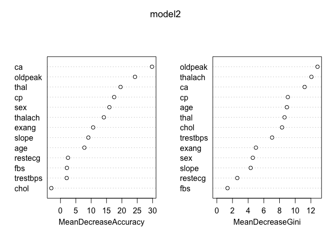<!-- -->

## References

### Data transformation

  - <https://archive.ics.uci.edu/ml/datasets/Heart+Disease>  
  - <https://lucdemortier.github.io/projects/3_mcnulty>  
  - <https://www.kaggle.com/ronitf/heart-disease-uci/discussion/105877>

### Kaggles notebooks:

  - R notebooks:  
  - <https://www.kaggle.com/ekrembayar/heart-disease-uci-eda-models-with-r>  
  - <https://www.kaggle.com/joemenifee/heart-disease-uci-data-exploratory>

### Data Processing

  - <http://www.cookbook-r.com/>
  - <https://bookdown.org/rdpeng/exdata/managing-data-frames-with-the-dplyr-package.html#data-frames>
  - <https://rpkgs.datanovia.com/ggpubr/reference/stat_compare_means.html>  
  - <https://towardsdatascience.com/simple-fast-exploratory-data-analysis-in-r-with-dataexplorer-package-e055348d9619>  
  - <http://www.sthda.com/english/articles/24-ggpubr-publication-ready-plots/81-ggplot2-easy-way-to-mix-multiple-graphs-on-the-same-page/>  
  - <https://www.r-graph-gallery.com/267-reorder-a-variable-in-ggplot2>  
  - for categorical variable  
  - <https://www.analyticsvidhya.com/blog/2015/11/easy-methods-deal-categorical-variables-predictive-modeling/>  
    for correlations  
  - <http://www.sthda.com/english/wiki/ggally-r-package-extension-to-ggplot2-for-correlation-matrix-and-survival-plots-r-software-and-data-visualization>

### for Machine Learning

  - <https://www.kaggle.com/naik170106027/prediction-of-heart-diseases>  
  - <https://www.kaggle.com/ekrembayar/heart-disease-uci-eda-models-with-r>  
  - <https://www.kaggle.com/anirbanshaw24/heart-disease-prediction-and-indicators>  
  - <http://topepo.github.io/caret/index.html>  
  - <https://www.youtube.com/watch?v=SeyghJ5cdm4&feature=youtu.be>  
  - <https://www.rdocumentation.org/packages/rpart/versions/4.1-15/topics/rpart>  
  - <https://stackoverflow.com/questions/33767804/invalid-prediction-for-rpart-object-error>  
  - <https://machinelearningmastery.com/overfitting-and-underfitting-with-machine-learning-algorithms/>  
  - <https://www.gormanalysis.com/blog/decision-trees-in-r-using-rpart/>  
  - <https://www.kaggle.com/wguesdon/tuning-random-forest-parameters/edit>

### For Rstudio

  - <https://community.rstudio.com/t/shortcut-to-remove-results-from-r-notebook/9147>
