```{python}
#| include: false
import re
import warnings
import numpy as np
import pandas as pd
from pathlib import Path

warnings.filterwarnings("ignore")

DATA = Path("../../data")
df_raw = pd.read_csv(DATA / "train.csv")

# ── Cleaning (mirrors eda_plots.py) ──────────────────────────────────────────
SLEEP_MAP = {
    "Less than 5 hours": 4.0, "5-6 hours": 5.5, "6-7 hours": 6.5,
    "6-8 hours": 7.0, "7-8 hours": 7.5, "8 hours": 8.0,
    "8-9 hours": 8.5, "More than 8 hours": 9.0, "9-11 hours": 10.0,
}

def parse_sleep(s):
    if pd.isna(s): return np.nan
    s = str(s).strip()
    if s in SLEEP_MAP: return SLEEP_MAP[s]
    m = re.match(r"^(\d+(?:\.\d+)?)-(\d+(?:\.\d+)?)\s*hours?$", s, re.I)
    if m: return (float(m.group(1)) + float(m.group(2))) / 2
    m = re.match(r"^(\d+(?:\.\d+)?)\s*hours?$", s, re.I)
    if m: return float(m.group(1))
    return np.nan

DIET_MAP = {"Healthy": "Healthy", "Moderate": "Moderate", "Unhealthy": "Unhealthy"}

df = df_raw.copy()
df["Sleep_Hours"] = df["Sleep Duration"].apply(parse_sleep)
df["Diet"] = df["Dietary Habits"].map(DIET_MAP)
df["Status"] = df["Depression"].map({0: "No Depression", 1: "Depression"})
df["Work_Status"] = df["Working Professional or Student"]
df["Suicidal"] = df["Have you ever had suicidal thoughts ?"]
df["Family_History"] = df["Family History of Mental Illness"]
df["Financial_Stress"] = df["Financial Stress"]
df["Work_Study_Hours"] = df["Work/Study Hours"]
df["Age_Group"] = pd.cut(df["Age"], bins=[17,24,30,39,49,60],
                         labels=["18–24","25–30","31–39","40–49","50–60"])

n_train = len(df)
n_depressed = df["Depression"].sum()
depression_rate = n_depressed / n_train * 100
n_professionals = (df["Work_Status"] == "Working Professional").sum()
n_students = (df["Work_Status"] == "Student").sum()
```

## Overview

This report explores the **PS4E11 Mental Health Depression** dataset — a synthetic tabular dataset
derived from the [Student Depression Dataset](https://www.kaggle.com/datasets/hopesb/student-depression-dataset)
and expanded to include working professionals.

```{python}
#| label: tbl-overview
#| tbl-cap: "Dataset at a glance"
summary = pd.DataFrame({
    "Metric": [
        "Total respondents", "Depressed", "Not depressed", "Depression rate",
        "Working Professionals", "Students",
        "Age range", "Features",
    ],
    "Value": [
        f"{n_train:,}", f"{n_depressed:,}", f"{n_train - n_depressed:,}",
        f"{depression_rate:.1f}%",
        f"{n_professionals:,}", f"{n_students:,}",
        f"{int(df['Age'].min())}–{int(df['Age'].max())} years",
        str(df_raw.shape[1] - 2),  # minus id, target
    ]
})
summary.style.hide(axis="index").set_properties(**{"text-align": "left"})
```

::: {.callout-note}
The dataset is **class-imbalanced**: only **`{python} f"{depression_rate:.1f}"`%** of respondents
are labelled as depressed. Models must account for this to avoid predicting the majority class.
:::

---

## Target Distribution

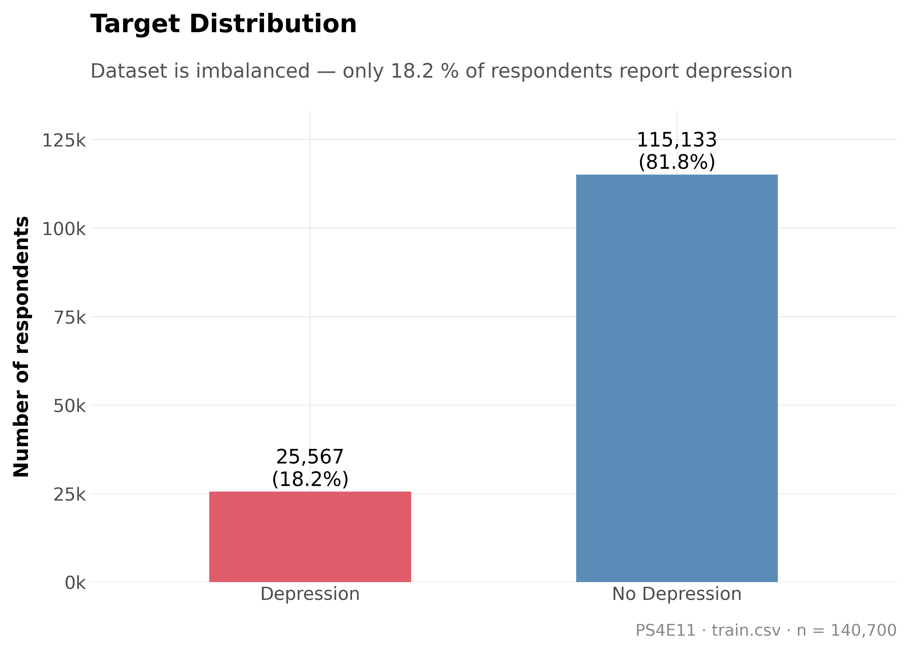{width=65%}

The majority class (no depression) makes up **`{python} f"{100-depression_rate:.1f}"`%** of the
training set. A naïve classifier that always predicts *no depression* would achieve
~81.8% accuracy — the real challenge is identifying the minority class.

---

## Demographics

### Gender and Work Status

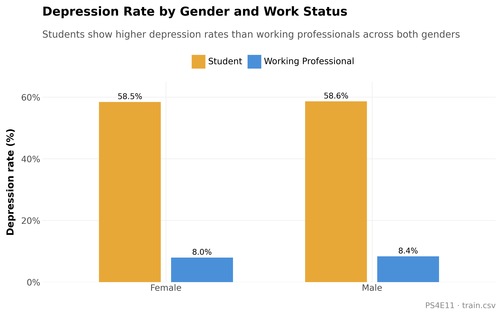

**Students consistently report higher depression rates** than working professionals,
regardless of gender. Female students show the highest rate among all four groups.
The gap between students and professionals is larger for females (~8 pp) than males (~5 pp).

### Age Groups

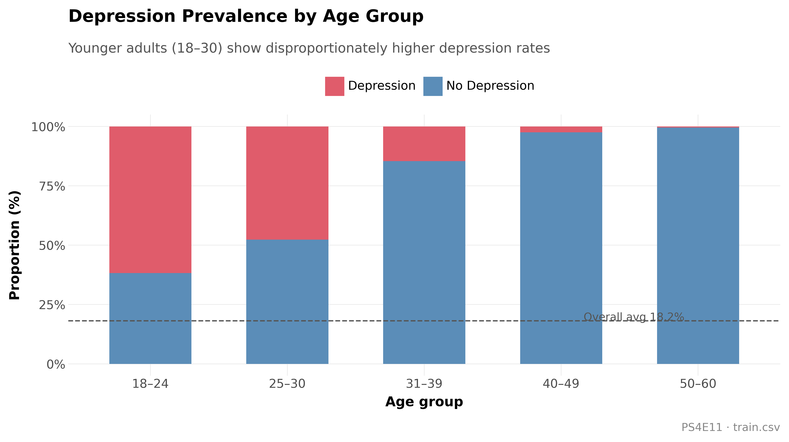

Younger cohorts (18–30) carry a noticeably higher depression burden.
This likely reflects the overlap with student respondents, who are over-represented
in the younger age bands, combined with early-career financial pressures.

---

## Lifestyle Factors

### Sleep Duration

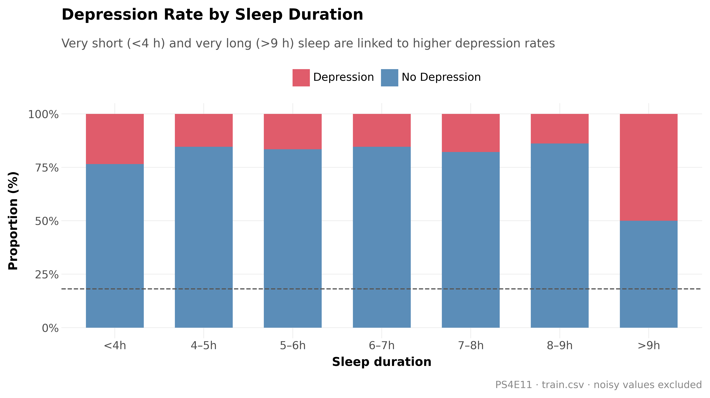

Both ends of the sleep spectrum are associated with elevated depression:

- **< 4 hours**: likely reflecting acute stress or insomnia co-morbid with depression.
- **> 9 hours**: hypersomnia, which is itself a recognised symptom of depression.
- The **6–8 hour** range shows the lowest rates, consistent with clinical sleep recommendations.

::: {.callout-warning}
The raw `Sleep Duration` column contains **`{python} str(df_raw["Sleep Duration"].nunique())`** unique values,
including city names ("Indore", "Pune") and unrelated labels ("Unhealthy", "Moderate")
injected by the synthetic data generation process. Only interpretable values
(`{python} str(df["Sleep_Hours"].notna().sum())` of `{python} str(len(df))`) were retained.
:::

### Work / Study Hours

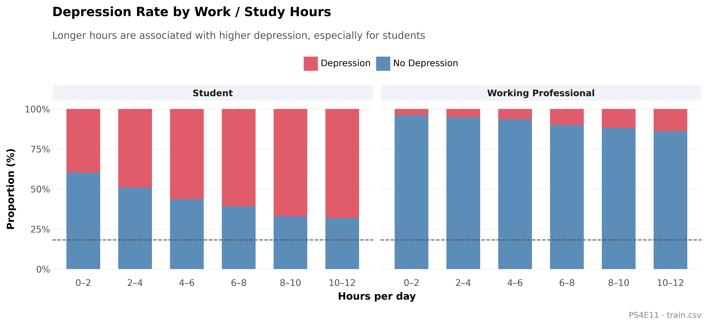

Longer daily hours correlate with higher depression rates in both groups.
The effect is steeper for **students**: those studying 10–12 hours/day show
a depression rate roughly double that of students studying under 4 hours.

---

## Stressors

### Financial Stress

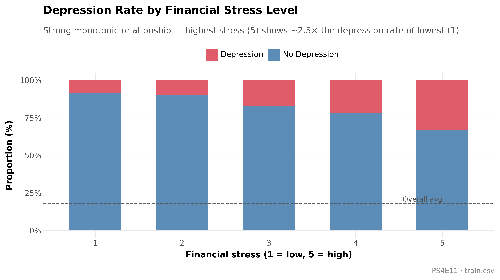

Financial stress shows the **strongest monotonic relationship** with depression of any
single numerical feature. Respondents at level 5 (highest stress) have a depression
rate approximately **2.5×** that of respondents at level 1.

### Academic & Work Pressure

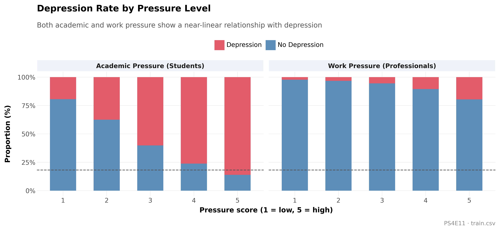

Both pressure scores exhibit near-linear relationships with depression, mirroring
the financial stress pattern. Academic pressure (students) spans a slightly wider
range of outcomes than work pressure (professionals).

---

## Risk Factors

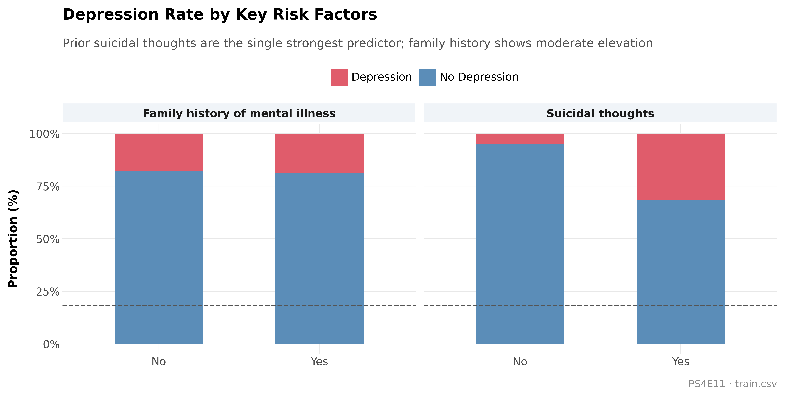

**Prior suicidal thoughts** are the single most powerful predictor in the dataset —
respondents who answered *Yes* show a depression rate more than **3×** that of those
who answered *No*. Family history of mental illness also elevates risk, though
more modestly (~1.5× increase).

::: {.callout-important}
These are observational associations, not causal claims. Suicidal thoughts may be
a *consequence* of depression rather than an independent predictor.
:::

---

## Profession Analysis

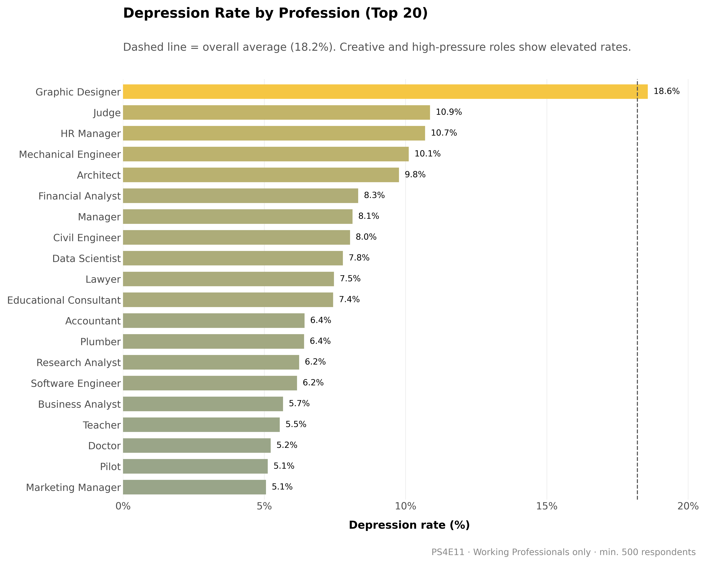

Among working professionals, high-creativity and high-stakes roles
(writers, managers, consultants) tend to cluster above the average line.
The dashed line marks the overall average (18.2%); colour encodes the
deviation — blue = below average, red = above average.

---

## Feature Correlations

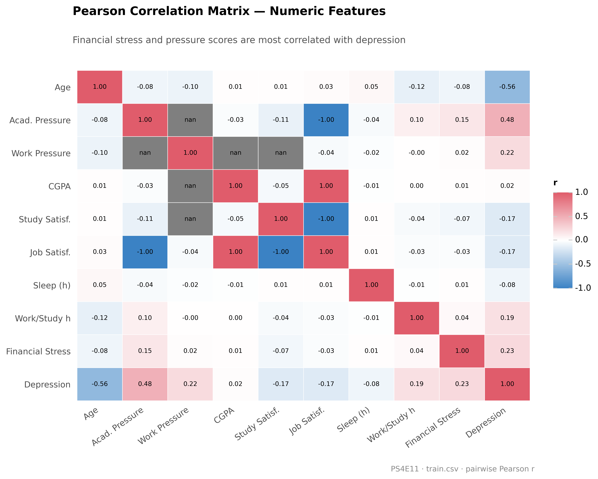

Key observations from the Pearson correlation matrix:

| Relationship | r |
|---|---|
| Financial Stress → Depression | strongest positive |
| Work/Academic Pressure → Depression | moderate positive |
| Job/Study Satisfaction → Depression | moderate negative |
| Sleep Hours → Depression | weak negative |
| Age → Depression | near-zero |

Pressure and satisfaction scores are inversely correlated with each other,
suggesting they capture complementary dimensions of well-being.

---

## Missing Data

### Overview

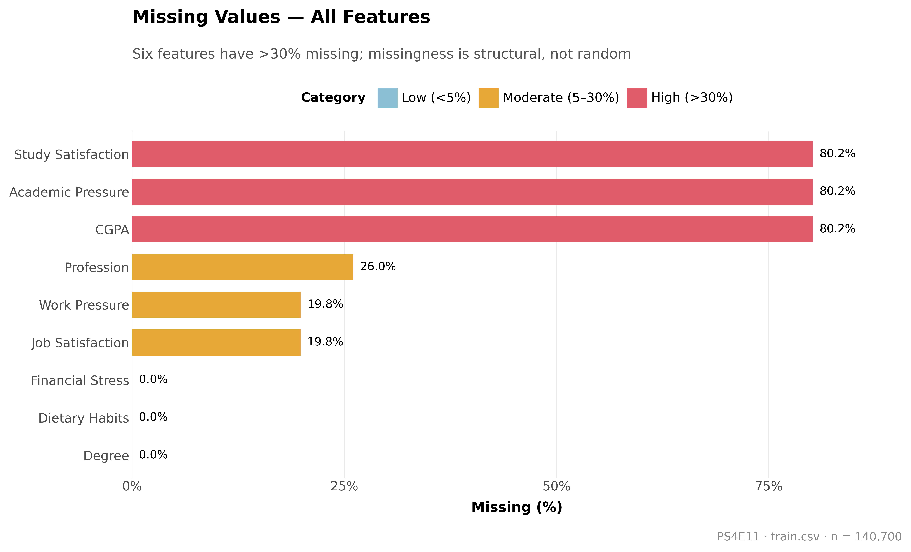

Six features are missing in more than 30% of rows. Crucially, none of this is random noise —
the missingness is entirely *structural*, driven by whether the respondent is a
working professional or a student.

### Missingness Pattern Matrix

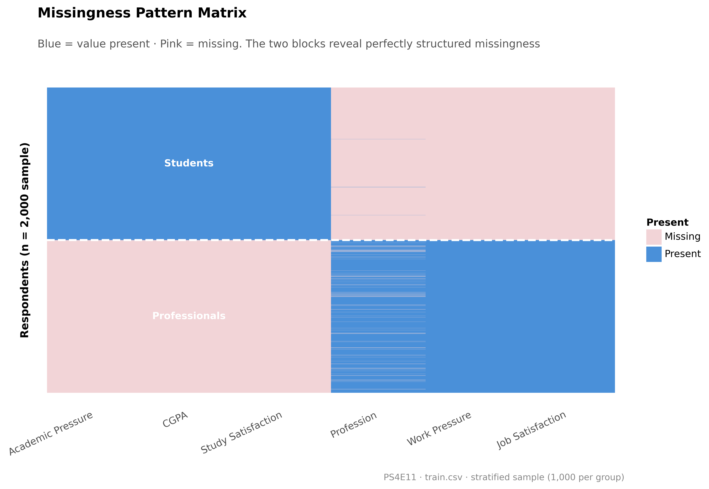

This matrix visualises a stratified sample of 2,000 respondents (1,000 per group).
Blue = value present, pink = missing. The two perfectly symmetric blocks confirm
that missingness is a deterministic function of work status — there is no partial
or random missingness in these columns.

### Missing Rate by Work Status

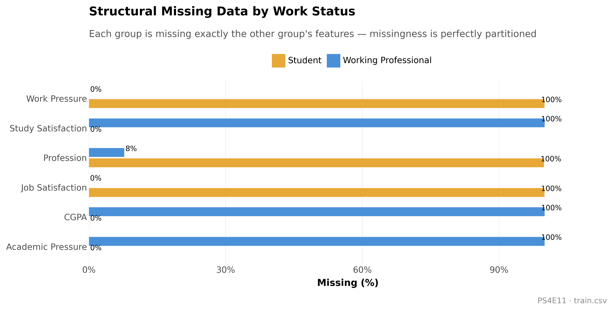

Each group is missing **exactly** the other group's features:

- **Working professionals**: 100% missing *Academic Pressure*, *CGPA*, *Study Satisfaction*
- **Students**: 100% missing *Work Pressure*, *Job Satisfaction*
- **Profession**: missing for ~13% of students (they identify as "Student" rather than naming a profession)

### Is Missingness Itself Predictive?

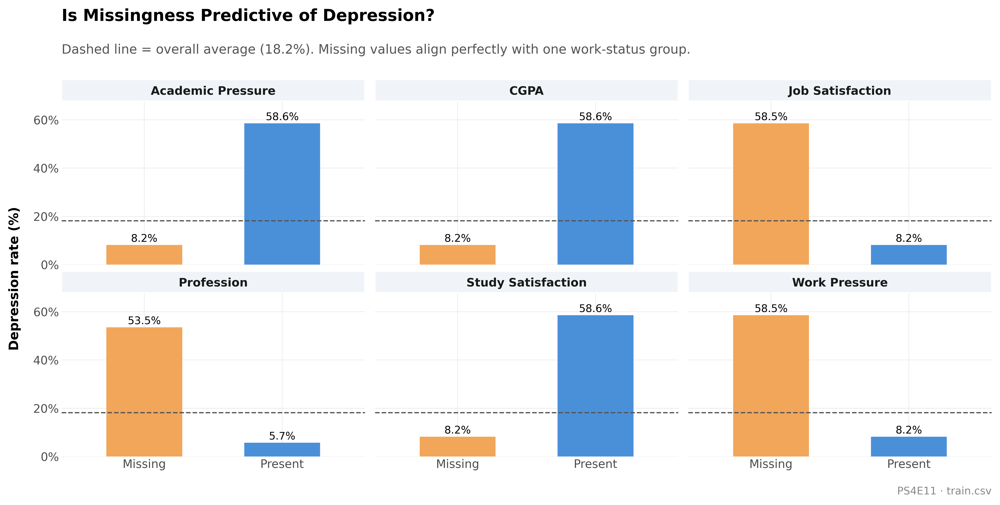

Because missingness perfectly aligns with work status — and students have a higher
depression rate than professionals — the missing/present flag is indirectly predictive.
For example, a missing *Work Pressure* value reliably identifies a student, who on
average has a ~25% depression rate versus ~17% for professionals.

::: {.callout-tip}
**Modelling implication**: rather than imputing with the column mean (which would
contaminate the structural signal), fill pressure/satisfaction columns with **0**
for the group that never has that value, and add a binary `is_student` / `is_professional`
indicator. AutoGluon handles this automatically; the LGB/XGB/CAT pipeline applies
this logic in `features.py`.
:::

---

## Modelling Notes

```{python}
#| label: tbl-model-results
#| tbl-cap: "SageMaker training results (10-fold CV)"
import json

artifacts = Path("../../artifacts")
results = []
for model, label, note in [
    ("lgb", "LightGBM", "10-fold CV · Optuna · hand-crafted features"),
    ("xgb", "XGBoost", "10-fold CV · Optuna · GPU · hand-crafted features"),
    ("cat", "CatBoost", "10-fold CV · Optuna · GPU · native categoricals"),
]:
    p = artifacts / model / f"{model}_results.json"
    if p.exists():
        r = json.loads(p.read_text())
        results.append({
            "Model": label,
            "OOF Accuracy": f"{r['cv_accuracy_mean']:.5f}",
            "Folds": r["n_folds"],
            "Notes": note,
        })

autogluon_path = artifacts / "autogluon" / "autogluon_results.json"
if autogluon_path.exists():
    r = json.loads(autogluon_path.read_text())
    results.append({
        "Model": "AutoGluon",
        "OOF Accuracy": f"{r['cv_accuracy_mean']:.5f}",
        "Folds": r["n_folds"],
        "Notes": "best_quality preset · raw features · 30-min run",
    })

ensemble_path = Path("../../ensemble/ensemble_results.json")
if ensemble_path.exists():
    e = json.loads(ensemble_path.read_text())
    method = e["best_method"]
    weights = e.get("best_weights", {})
    weight_str = ", ".join(f"{k}={v:.2f}" for k, v in weights.items()) if isinstance(weights, dict) else str(weights)
    results.append({
        "Model": f"**Ensemble ({method})**",
        "OOF Accuracy": f"**{e['best_score']:.5f}**",
        "Folds": "—",
        "Notes": weight_str[:60] if weight_str else "—",
    })

pd.DataFrame(results).style.hide(axis="index")
```

```{python}
#| label: tbl-ensemble-comparison
#| tbl-cap: "Ensemble strategy comparison"
if ensemble_path.exists():
    e = json.loads(ensemble_path.read_text())
    rows = []
    for method, info in e.get("all_results", {}).items():
        rows.append({
            "Strategy": method.replace("_", " ").title(),
            "OOF Accuracy": f"{info['score']:.5f}",
        })
    rows.sort(key=lambda x: x["OOF Accuracy"], reverse=True)
    pd.DataFrame(rows).style.hide(axis="index")
```

The pipeline trains four models on **AWS SageMaker** (spot instances) with 10-fold
cross-validation. LGB, XGB, and CAT use hand-crafted feature engineering (`features.py`);
AutoGluon operates on raw data with its own automated preprocessing and ensembling.

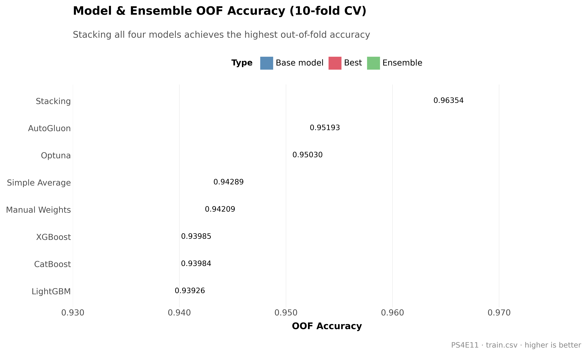

### Ensemble strategy comparison

| Strategy | OOF Accuracy | Public Score | Private Score |
|---|---|---|---|
| LGB + XGB + CAT (Optuna weights) | 0.94013 | 0.94079 | 0.94079 |
| LGB + XGB + CAT + AutoGluon (Stacking) | 0.96354 | 0.93699 | 0.93524 |
| **LGB + XGB + CAT + AutoGluon (Simple avg)** | **0.94289** | **0.94147** | **0.94105** |
| AutoGluon alone (notebook, best_quality 4h) | — | 0.94227 | 0.94141 |

::: {.callout-warning}
**Stacking overfit badly.** The meta-learner produced an OOF score of 0.96354
but a private score of only 0.93524 — a 2.8 pp gap. Root cause: the AutoGluon OOF
came from a 30-minute run whose predictions were not reliable enough for the
meta-learner to generalise. The stacking model effectively memorised training-set
patterns that didn't transfer to the test set.

**Lesson:** when base model OOF quality is uneven (30-min AutoGluon vs full 10-fold
tuned LGB/XGB/CAT), simple averaging or conservative Optuna weighting is more robust
than stacking. Stacking requires all base models to have equally clean, high-quality
OOF predictions.
:::

The **simple average** ensemble (OOF 0.94289) scored **0.94105 private** — our best
result, just 0.00036 behind the standalone AutoGluon notebook (0.94141). Adding
AutoGluon to the ensemble effectively closed the gap with only a 30-minute training run.

---

## Data Quality Issues

The dataset contains several synthetic noise artefacts worth noting:

1. **Sleep Duration** — 36 unique values including city names and unrelated labels.
2. **Dietary Habits** — 24 unique values including names, numbers, and irrelevant categories.
3. **Structural NaN** — pressure/satisfaction columns are structurally empty for one work-status group.
4. **Name feature** — 422 unique first names that encode some signal (likely an artefact of the synthetic generation process).

---

*Report generated with [Quarto](https://quarto.org) · Plots: [plotnine](https://plotnine.org) · Data: [Kaggle PS4E11](https://www.kaggle.com/competitions/playground-series-s4e11)*
