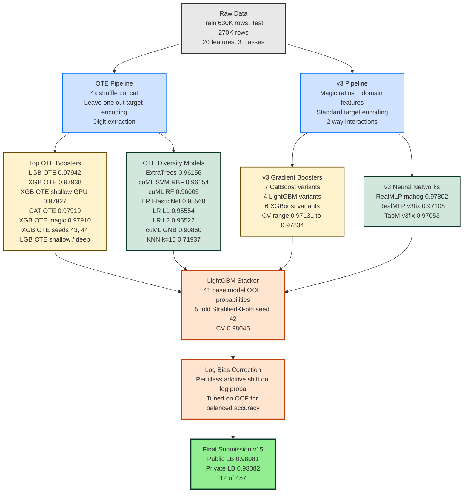

# PS6E4 Model and Ensembling DAG

Mermaid version. Renders natively on GitHub, GitLab, Notion, and Obsidian. For Kaggle, render the `dag.dot` Graphviz file to PNG and upload as an image.

## Models Excluded from the Stacker

These were trained but did not enter the final ensemble.

| Model | CV | Reason excluded |
|-------|-----|-----------------|
| GraphSAGE GNN | 0.97073 | hurt LB when added |
| RealMLP on OTE features | 0.96509 | fillna(0) breaks MLP on NaN heavy OTE |
| XGB Residual | 0.96633 | formula correction has low ceiling |
| cat_utaazu (public OOF) | 0.97872 | baked in bias from non matching folds |
| ravi_baseline (public) | 0.97850 | KFold not StratifiedKFold |
| AutoGluon | 0.96430 | no custom feature engineering |
| TabPFN | n/a | hit Kaggle 12h GPU limit on fold 1 of 5 |
| Pseudo labeling LGB | 0.95390 | lost 4x OTE shuffle aug, 99.9 percent label agreement adds no signal |
