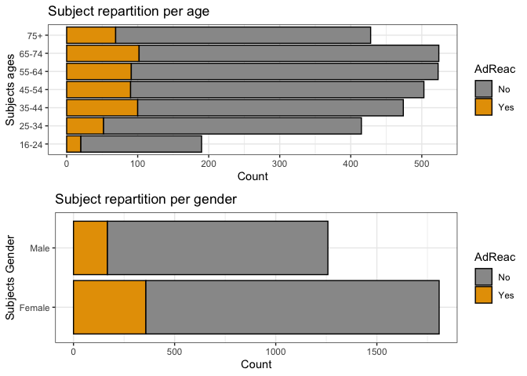
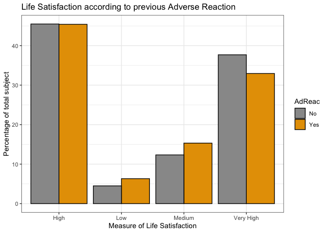
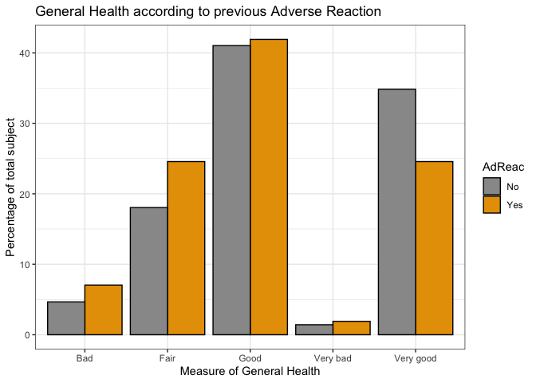
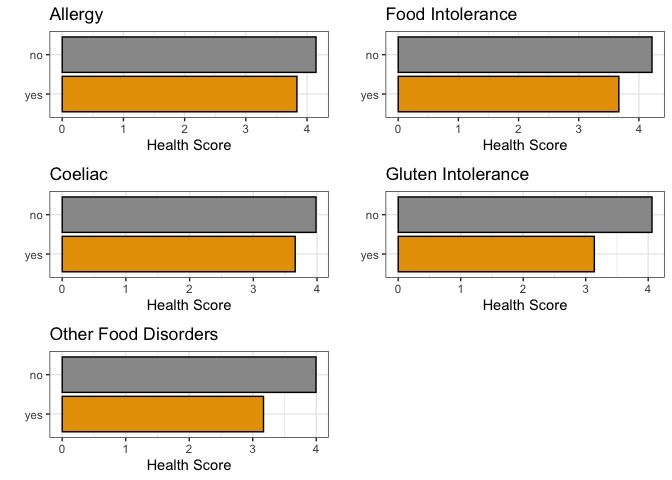
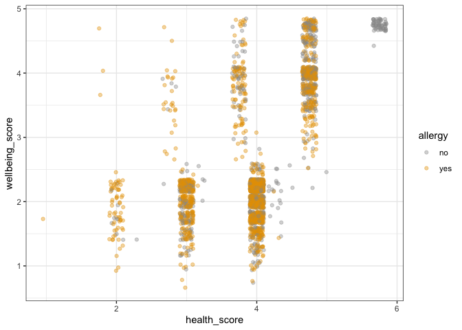
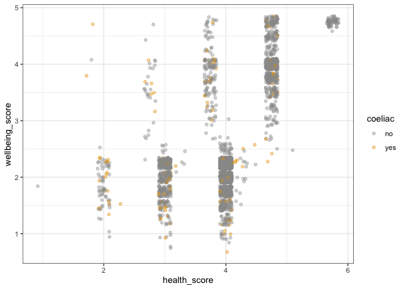
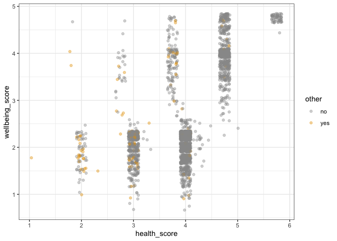

FSA Hackathon: young population survey analysis
================
William Guesdon  
Compiled: February 14, 2020

-   [I Dataset](#i-dataset)
    -   [A General population survey](#a-general-population-survey)
        -   [EDA general dataset](#eda-general-dataset)
        -   [select feature of interest](#select-feature-of-interest)
        -   [plot life satisfaction by adreact status](#plot-life-satisfaction-by-adreact-status)
        -   [Measure of General Health according to previous adverse reaction](#measure-of-general-health-according-to-previous-adverse-reaction)
        -   [Dummy coding for correlation study](#dummy-coding-for-correlation-study)
    -   [B Young population Survey](#b-young-population-survey)
-   [II Visualization](#ii-visualization)
    -   [A General popualtion survey](#a-general-popualtion-survey)
    -   [B Young population survey](#b-young-population-survey-1)
        -   [1 Health and Weelbeing scores by age](#health-and-weelbeing-scores-by-age)
        -   [2 Health score by food disorder status](#health-score-by-food-disorder-status)
        -   [3 Wellbeing score by food disorder status](#wellbeing-score-by-food-disorder-status)
        -   [4 Correlation between food disorder and Health Weelbeing score](#correlation-between-food-disorder-and-health-weelbeing-score)
-   [III Conclusions](#iii-conclusions)
-   [References](#references)

The Food Standards Agency (FSA) is an independent government department working across England, Wales and Northern Ireland to protect public health and consumers’ wider interest in food. The FSA is responsible for making sure food is safe and what it says it is.
On Sat, November 23, 2019 FSA and Pivigo organized a [Hackathon](https://www.eventbrite.com/e/food-standards-agency-data-science-hackathon-tickets-77135950705?utm_source=eventbrite&utm_medium=email&utm_campaign=reminder_attendees_48hour_email&utm_term=eventname&ref=eemaileventremind#) to analyse food survey questionaires.

I Dataset
=========

A General population survey
---------------------------

### EDA general dataset



### select feature of interest

### plot life satisfaction by adreact status

Need to express life satisfaction categories as a percentage of subset with adreaction or not



### Measure of General Health according to previous adverse reaction




### Dummy coding for correlation study

See <https://cran.r-project.org/web/packages/fastDummies/vignettes/making-dummy-variables.html>

    ## Warning: package 'fastDummies' was built under R version 3.5.2

Correlation plot

    ## Warning in ggcorr(results, palette = "RdBu"): data in column(s) 'RespSex',
    ## 'AdReac', 'AvoidFd', 'age_dv', 'Q6_1', 'ons_lifesat', 'ons_worthw', 'ons_happy',
    ## 'ons_anxiety' are not numeric and were ignored


    ## Warning: package 'ggcorrplot' was built under R version 3.5.2

B Young population Survey
-------------------------

Young population food disorder and general health and wellbeing related assesment questions.

``` r
young <- read_csv("/Users/william/Documents/GitHub/FSA_20191123/Data/Q1_Allergies/young-people-and-food-allergies-intolerances-2018.csv")
```

Since the survey does not include a general health and weelbeing assessment questions a score was determined in order to compare the young and general population survey. The score is a subjective estimation wich could be improved but comparison between young and general population will remain difficult in the abscence of standardize health and wellbeing questions between groups.

``` r
age <- young %>% select(3)
health_wellbeing <- bind_cols(age, health, wellbeing)
colnames(health_wellbeing)[1] <- "age"
health_wellbeing$age <- as.factor(health_wellbeing$age)
```

II Visualization
================

A General popualtion survey
---------------------------

B Young population survey
-------------------------

The goal of this survey is to gain more insigth into the young population in particular.

### 1 Health and Weelbeing scores by age


### 2 Health score by food disorder status



### 3 Wellbeing score by food disorder status


### 4 Correlation between food disorder and Health Weelbeing score



III Conclusions
===============

1.  Surverys are best designed with the hypothesis in mind. The young population survey didn't have general health and wellbeing assesement preventing clear exploration of the hypothesis
2.  No clear effect of food disorder on general gealth and wellbeing in the young population

References
==========

-   [Analyzing Thanksgiving dinners in R](https://www.youtube.com/watch?v=rxJZT0duwfU)
-   [Analyzing Survey Data in R](https://www.datacamp.com/courses/analyzing-survey-data-in-r)
-   [colorblind-friendly-palette](http://www.cookbook-r.com/Graphs/Colors_(ggplot2)/#a-colorblind-friendly-palette)
-   [Recode variable](http://www.cookbook-r.com/Manipulating_data/Recoding_data/)
-   [Using stat\_ instead of dplyr to summarize groups in a ggplot?](https://community.rstudio.com/t/using-stat-instead-of-dplyr-to-summarize-groups-in-a-ggplot/13916)
