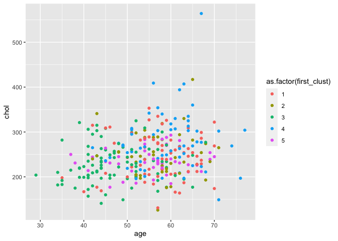
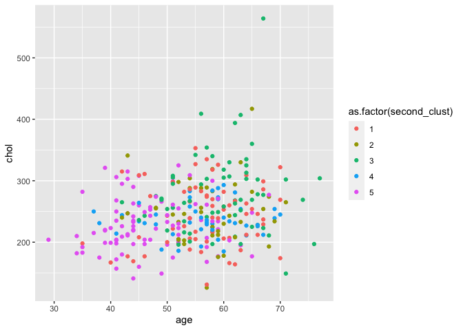
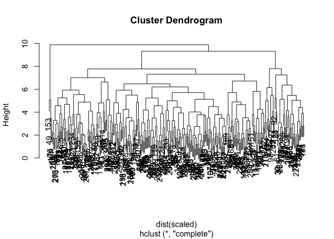
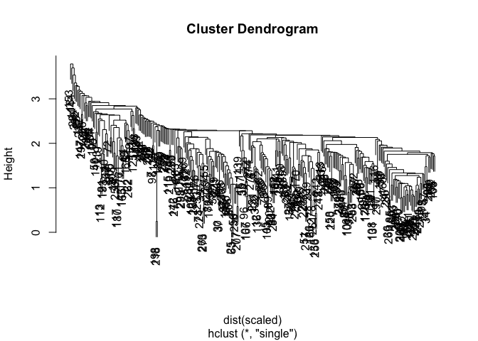
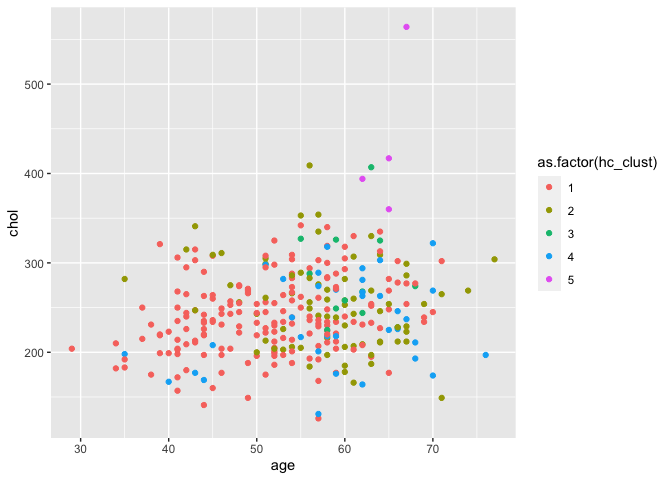
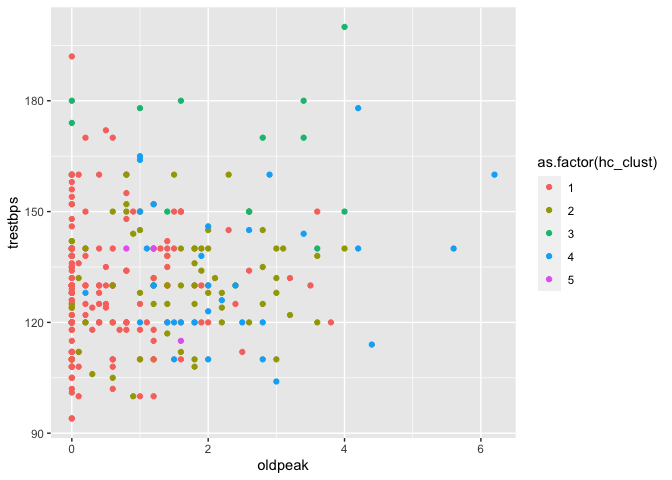

Clustering\_Heart\_Disease\_Patients
================
09/11/2019

# 1\. Targeting treatment for heart disease patients

``` r
# Load the data
heart_disease <- read.csv("datasets/heart_disease_patients.csv")

# Print the first ten rows
head(heart_disease)
```

    ##   id age sex cp trestbps chol fbs restecg thalach exang oldpeak slope
    ## 1  1  63   1  1      145  233   1       2     150     0     2.3     3
    ## 2  2  67   1  4      160  286   0       2     108     1     1.5     2
    ## 3  3  67   1  4      120  229   0       2     129     1     2.6     2
    ## 4  4  37   1  3      130  250   0       0     187     0     3.5     3
    ## 5  5  41   0  2      130  204   0       2     172     0     1.4     1
    ## 6  6  56   1  2      120  236   0       0     178     0     0.8     1

# 2\. Quantifying patient differences

``` r
# Evidence that the data should be scaled?
summary(heart_disease)
```

    ##        id             age             sex               cp       
    ##  Min.   :  1.0   Min.   :29.00   Min.   :0.0000   Min.   :1.000  
    ##  1st Qu.: 76.5   1st Qu.:48.00   1st Qu.:0.0000   1st Qu.:3.000  
    ##  Median :152.0   Median :56.00   Median :1.0000   Median :3.000  
    ##  Mean   :152.0   Mean   :54.44   Mean   :0.6799   Mean   :3.158  
    ##  3rd Qu.:227.5   3rd Qu.:61.00   3rd Qu.:1.0000   3rd Qu.:4.000  
    ##  Max.   :303.0   Max.   :77.00   Max.   :1.0000   Max.   :4.000  
    ##     trestbps          chol            fbs            restecg      
    ##  Min.   : 94.0   Min.   :126.0   Min.   :0.0000   Min.   :0.0000  
    ##  1st Qu.:120.0   1st Qu.:211.0   1st Qu.:0.0000   1st Qu.:0.0000  
    ##  Median :130.0   Median :241.0   Median :0.0000   Median :1.0000  
    ##  Mean   :131.7   Mean   :246.7   Mean   :0.1485   Mean   :0.9901  
    ##  3rd Qu.:140.0   3rd Qu.:275.0   3rd Qu.:0.0000   3rd Qu.:2.0000  
    ##  Max.   :200.0   Max.   :564.0   Max.   :1.0000   Max.   :2.0000  
    ##     thalach          exang           oldpeak         slope      
    ##  Min.   : 71.0   Min.   :0.0000   Min.   :0.00   Min.   :1.000  
    ##  1st Qu.:133.5   1st Qu.:0.0000   1st Qu.:0.00   1st Qu.:1.000  
    ##  Median :153.0   Median :0.0000   Median :0.80   Median :2.000  
    ##  Mean   :149.6   Mean   :0.3267   Mean   :1.04   Mean   :1.601  
    ##  3rd Qu.:166.0   3rd Qu.:1.0000   3rd Qu.:1.60   3rd Qu.:2.000  
    ##  Max.   :202.0   Max.   :1.0000   Max.   :6.20   Max.   :3.000

``` r
# Remove id
heart_disease <- heart_disease[ , !(names(heart_disease) %in% c("id"))]

# Scaling data and saving as a data frame
scaled <- scale(heart_disease)

# What do the data look like now?
summary(scaled)
```

    ##       age               sex                cp             trestbps       
    ##  Min.   :-2.8145   Min.   :-1.4549   Min.   :-2.2481   Min.   :-2.14149  
    ##  1st Qu.:-0.7124   1st Qu.:-1.4549   1st Qu.:-0.1650   1st Qu.:-0.66420  
    ##  Median : 0.1727   Median : 0.6851   Median :-0.1650   Median :-0.09601  
    ##  Mean   : 0.0000   Mean   : 0.0000   Mean   : 0.0000   Mean   : 0.00000  
    ##  3rd Qu.: 0.7259   3rd Qu.: 0.6851   3rd Qu.: 0.8765   3rd Qu.: 0.47218  
    ##  Max.   : 2.4961   Max.   : 0.6851   Max.   : 0.8765   Max.   : 3.88132  
    ##       chol              fbs             restecg             thalach       
    ##  Min.   :-2.3310   Min.   :-0.4169   Min.   :-0.995103   Min.   :-3.4364  
    ##  1st Qu.:-0.6894   1st Qu.:-0.4169   1st Qu.:-0.995103   1st Qu.:-0.7041  
    ##  Median :-0.1100   Median :-0.4169   Median : 0.009951   Median : 0.1483  
    ##  Mean   : 0.0000   Mean   : 0.0000   Mean   : 0.000000   Mean   : 0.0000  
    ##  3rd Qu.: 0.5467   3rd Qu.:-0.4169   3rd Qu.: 1.015005   3rd Qu.: 0.7166  
    ##  Max.   : 6.1283   Max.   : 2.3905   Max.   : 1.015005   Max.   : 2.2904  
    ##      exang            oldpeak            slope        
    ##  Min.   :-0.6955   Min.   :-0.8954   Min.   :-0.9747  
    ##  1st Qu.:-0.6955   1st Qu.:-0.8954   1st Qu.:-0.9747  
    ##  Median :-0.6955   Median :-0.2064   Median : 0.6480  
    ##  Mean   : 0.0000   Mean   : 0.0000   Mean   : 0.0000  
    ##  3rd Qu.: 1.4331   3rd Qu.: 0.4827   3rd Qu.: 0.6480  
    ##  Max.   : 1.4331   Max.   : 4.4445   Max.   : 2.2708

# 3\. Let’s start grouping patients

``` r
# Set the seed so that results are reproducible
seed_val  <- 10
set.seed(seed_val)

# Select a number of clusters
k <- 5

# Run the k-means algorithm
first_clust <- kmeans(scaled, centers = k, nstart = 1)

# How many patients are in each cluster?
first_clust$size
```

    ## [1] 66 43 88 61 45

# 4\. Another round of k-means

``` r
# Set the seed
seed_val <- 38
set.seed(seed_val)

# Select a number of clusters and run the k-means algorithm
k <- 5
second_clust = kmeans(scaled, centers = k, nstart = 1)

# How many patients are in each cluster?
first_clust$size
```

    ## [1] 66 43 88 61 45

# 5\. Comparing patient clusters

``` r
# Add cluster assignments to the data
heart_disease["first_clust"] <- first_clust$cluster
heart_disease["second_clust"] <- second_clust$cluster

# Load ggplot2
library(ggplot2)

# Create and print the plot of age and chol for the first clustering algorithm
plot_one <- ggplot(heart_disease, aes(x=age, y=chol, 
                                  color=as.factor(first_clust))) +
  geom_point()
plot_one
```

<!-- -->

``` r
# Create and print the plot of age and chol for the second clustering algorithm
plot_two <- ggplot(heart_disease, aes(x=age, y=chol, 
                                  color=as.factor(second_clust))) + 
  geom_point()
plot_two
```

<!-- -->

# 6\. Hierarchical clustering: another clustering approach

``` r
# Execute hierarchical clustering with complete linkage
hier_clust_1 <- hclust(dist(scaled), method = "complete")

# Print the dendrogram
plot(hier_clust_1)
```

<!-- -->

``` r
# Get cluster assignments based on number of selected clusters
hc_1_assign <- cutree(hier_clust_1, 5)
```

# 7\. Hierarchical clustering round two

``` r
# Execute hierarchical clustering with single linkage
hier_clust_2 <- hclust(dist(scaled), method = "single")

# Print the dendrogram
plot(hier_clust_2)
```

<!-- -->

``` r
# Get cluster assignments based on number of selected clusters
hc_2_assign <- cutree(hier_clust_2, 5)
```

# 8\. Comparing clustering results

``` r
# adding assignments of chosen hierarchical linkage
heart_disease['hc_clust'] = hc_1_assign

# remove 'sex', 'first_clust', and 'second_clust' variables
hd_simple = heart_disease[, !(names(heart_disease) %in% c('sex', 'first_clust', 'second_clust'))]

# getting mean and standard deviation summary statistics
clust_summary = do.call(data.frame, aggregate(. ~hc_clust, data = hd_simple, function(x) c(avg = mean(x), sd = sd(x))))
clust_summary
```

    ##   hc_clust  age.avg   age.sd   cp.avg     cp.sd trestbps.avg trestbps.sd
    ## 1        1 51.41667 8.540979 2.783333 0.9470625     129.1389    15.93800
    ## 2        2 58.11111 7.754246 3.763889 0.6165112     130.0417    13.90657
    ## 3        3 61.00000 3.908034 3.916667 0.2886751     168.5000    17.45904
    ## 4        4 59.00000 9.203580 3.571429 0.8501112     134.7714    18.64070
    ## 5        5 64.75000 2.061553 3.250000 0.5000000     138.7500    18.42779
    ##   chol.avg  chol.sd   fbs.avg    fbs.sd restecg.avg restecg.sd thalach.avg
    ## 1 239.8722 42.29228 0.1222222 0.3284559   0.8444444  0.9905826    161.5722
    ## 2 253.2222 49.74476 0.1805556 0.3873488   1.4027778  0.9140488    135.5417
    ## 3 284.9167 53.00336 0.3333333 0.4923660   1.2500000  0.9653073    147.7500
    ## 4 233.8571 49.67136 0.1428571 0.3550358   0.6857143  0.9321521    116.8857
    ## 5 433.7500 89.93470 0.2500000 0.5000000   2.0000000  0.0000000    156.2500
    ##   thalach.sd  exang.avg  exang.sd oldpeak.avg oldpeak.sd slope.avg  slope.sd
    ## 1  15.779214 0.07777778 0.2685686    0.555000  0.7847196  1.388889 0.5730336
    ## 2  17.991342 0.81944444 0.3873488    1.451389  1.0804268  1.750000 0.5240686
    ## 3  13.157266 0.75000000 0.4522670    2.316667  1.4708274  2.166667 0.5773503
    ## 4  17.842071 0.48571429 0.5070926    2.240000  1.3856831  2.200000 0.4058397
    ## 5   3.774917 0.00000000 0.0000000    1.100000  0.3829708  1.500000 0.5773503

# 9\. Visualizing the cluster contents

``` r
# Plot age and chol
plot_one <- ggplot(heart_disease, aes(x = age, y = chol, 
                                      color = as.factor(hc_clust))) + 
  geom_point()
plot_one 
```

<!-- -->

``` r
# Plot oldpeak and trestbps
plot_two <- ggplot(heart_disease, aes(x = oldpeak, y = trestbps, 
                                      color = as.factor(hc_clust))) + 
  geom_point()
plot_two
```

<!-- -->
